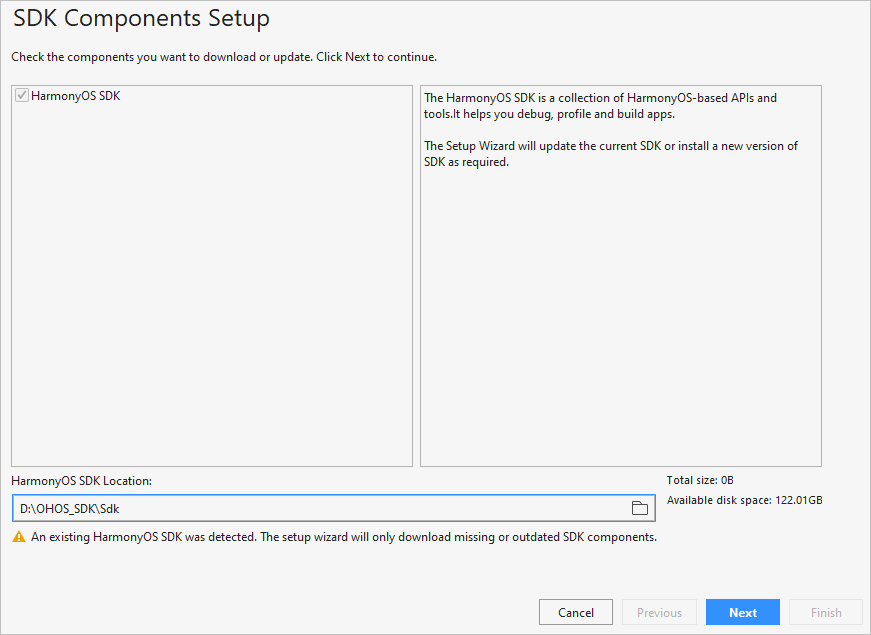
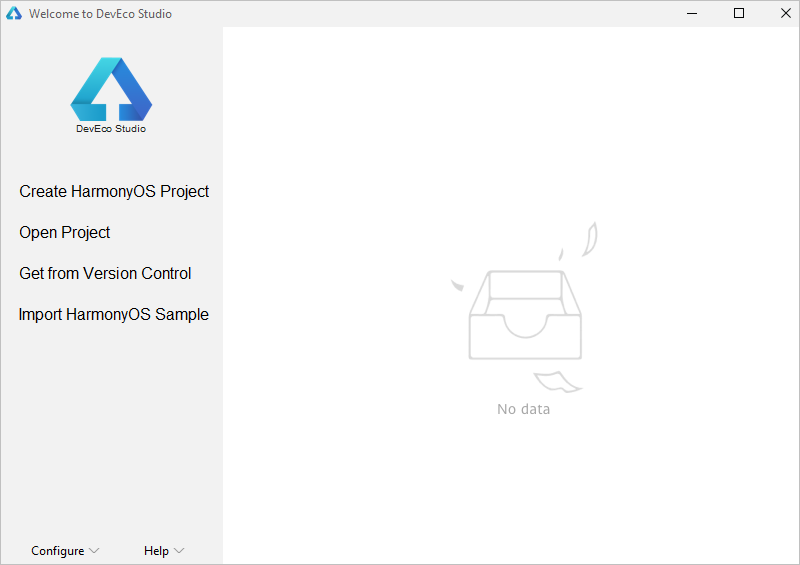

# Configuring the OpenHarmony SDK<a name="EN-US_TOPIC_0000001113561194"></a>

-   [Prerequisites](#section164161442154812)
-   [Configuring the SDK Information](#section1265592425017)

To set up the OpenHarmony app development environment, configure the corresponding SDK information in DevEco Studio first.

> **NOTE:** 
>The OpenHarmony SDK is of the API Version 6 Canary1, with some toolchains removed, which is not applicable to HarmonyOS app development.

## Prerequisites<a name="section164161442154812"></a>

-   [DevEco Studio 2.1 Release](https://developer.harmonyos.com/en/develop/deveco-studio#download)  or later has been downloaded and installed.
-   The  [OpenHarmony SDK](https://mirror.iscas.ac.cn/OpenHarmony/sdk/)  package has been obtained and decompressed.

## Configuring the SDK Information<a name="section1265592425017"></a>

DevEco Studio manages SDKs and toolchains using SDK Manager. OpenHarmony contains the following SDK packages:

<a name="table64565810577"></a>
<table><thead align="left"><tr id="row12455580576"><th class="cellrowborder" valign="top" width="24.709999999999997%" id="mcps1.1.4.1.1"><p id="p34565812572"><a name="p34565812572"></a><a name="p34565812572"></a>Type</p>
</th>
<th class="cellrowborder" valign="top" width="25.3%" id="mcps1.1.4.1.2"><p id="p104675817575"><a name="p104675817575"></a><a name="p104675817575"></a>Package Name</p>
</th>
<th class="cellrowborder" valign="top" width="49.99%" id="mcps1.1.4.1.3"><p id="p194610586574"><a name="p194610586574"></a><a name="p194610586574"></a>Description</p>
</th>
</tr>
</thead>
<tbody><tr id="row134615875716"><td class="cellrowborder" rowspan="2" valign="top" width="24.709999999999997%" headers="mcps1.1.4.1.1 "><p id="p8312243811"><a name="p8312243811"></a><a name="p8312243811"></a>SDK</p>
</td>
<td class="cellrowborder" valign="top" width="25.3%" headers="mcps1.1.4.1.2 "><p id="p674413467918"><a name="p674413467918"></a><a name="p674413467918"></a>Java</p>
</td>
<td class="cellrowborder" valign="top" width="49.99%" headers="mcps1.1.4.1.3 "><p id="p107441464917"><a name="p107441464917"></a><a name="p107441464917"></a>SDK for Java.</p>
</td>
</tr>
<tr id="row44334409916"><td class="cellrowborder" valign="top" headers="mcps1.1.4.1.1 "><p id="p1946175813574"><a name="p1946175813574"></a><a name="p1946175813574"></a>JS</p>
</td>
<td class="cellrowborder" valign="top" headers="mcps1.1.4.1.2 "><p id="p54625885713"><a name="p54625885713"></a><a name="p54625885713"></a>SDK for JS.</p>
</td>
</tr>
<tr id="row14474585576"><td class="cellrowborder" rowspan="2" valign="top" width="24.709999999999997%" headers="mcps1.1.4.1.1 "><p id="p124765819578"><a name="p124765819578"></a><a name="p124765819578"></a>SDK Tool</p>
</td>
<td class="cellrowborder" valign="top" width="25.3%" headers="mcps1.1.4.1.2 "><p id="p1947135818571"><a name="p1947135818571"></a><a name="p1947135818571"></a>Toolchains</p>
</td>
<td class="cellrowborder" valign="top" width="49.99%" headers="mcps1.1.4.1.3 "><p id="p7471158105711"><a name="p7471158105711"></a><a name="p7471158105711"></a>Includes compiling, packaging, signing, database management, and other tools that are required to develop OpenHarmony apps.</p>
</td>
</tr>
<tr id="row337931010"><td class="cellrowborder" valign="top" headers="mcps1.1.4.1.1 "><p id="p193791108"><a name="p193791108"></a><a name="p193791108"></a>Previewer</p>
</td>
<td class="cellrowborder" valign="top" headers="mcps1.1.4.1.2 "><p id="p1238951018"><a name="p1238951018"></a><a name="p1238951018"></a>OpenHarmony app previewer, which can be used to view the UI layout during app development.</p>
</td>
</tr>
</tbody>
</table>

1.  Open DevEco Studio. If this is the first time you are using it, select  **Do not import settings**  and click  **OK**.
2.  Follow the instructions in DevEco Studio to go to the SDK download page. In the  **HarmonyOS SDK Location**  field, select the local directory where the SDK package was decompressed, then click  **Next**.

    > **NOTE:** 
    >If you are not using DevEco Studio for the first time, the SDK download page may not be displayed. In this case, go to  **Configure**  \(or  \) \>  **Settings**  \>  **Appearance & Behavior**  \>  **System Settings**  \>  **HarmonyOS SDK**  and click  **HarmonyOS SDK Location**  to download the SDK.

    

3.  After the SDK is installed, click  **Finish**. The DevEco Studio welcome page will then be displayed.

    

4.  Go to the  **Sdk\\js\\_version number_\\build-tools\\ace-loader**  directory, run the following commands in CLI, and wait until the installation is complete.

    ```
    npm cache clean -f
    npm install
    ```

    


