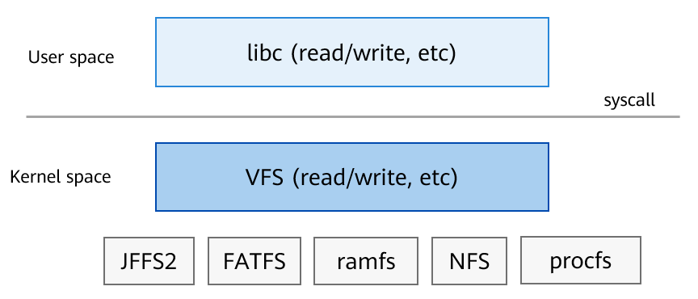

# File Systems

A file system \(often abbreviated to FS\) provides an input and output manner for an OS. It implements the interaction with internal and external storage devices.

The file system provides standard POSIX operation APIs for the upper-layer system through the C library. For details, see the API reference of the C library. The VFS virtual layer in kernel space shields the differences between file systems. The basic architecture is as follows:

**Figure  1**  Overall file system architecture  

-   **[Virtual File System](kernel-small-bundles-fs-virtual.md)**  

-   **[Supported File Systems](kernel-small-bundles-fs-support.md)**  

-   **[File System Adaptation](kernel-small-bundles-fs-new.md)**  

