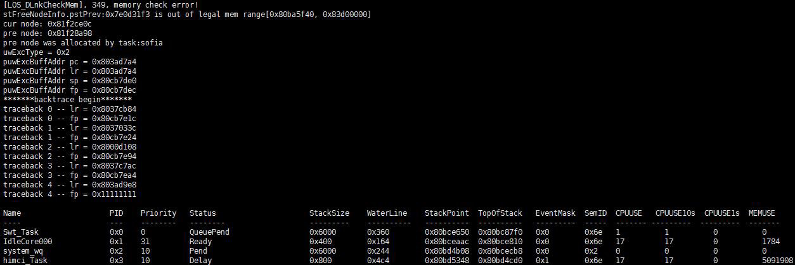

# memcheck

-   [Command Function](#section191633812516)
-   [Syntax](#section428816435510)
-   [Parameters](#section1939943304411)
-   [Usage](#section228914491951)
-   [Example](#section17373205314515)
-   [Output](#section13406205385413)

## Command Function

This command is used to check whether the dynamically requested memory block is complete and whether nodes in the memory pool are damaged due to out-of-bounds memory access.

## Syntax

memcheck

## Parameters

None

## Usage

-   If all nodes in the memory pool are complete, "system memcheck over, all passed!" is displayed.
-   If a node in the memory pool is incomplete, information about the memory block of the corrupted node is displayed.

## Example

Run  **memcheck**.

## Output

**Figure  1**  No out-of-bounds memory access  

**Figure  2**  Out-of-bounds memory access  

