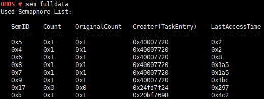

# sem

-   [Command Function](#section366714216619)
-   [Syntax](#section8833164614615)
-   [Parameters](#section12809111019453)
-   [Usage](#section15935131220717)
-   [Example](#section79281818476)
-   [Output](#section1975118519456)

## Command Function

This command is used to query information about kernel semaphores.

## Syntax

sem \[_ID__ / fulldata_\]

## Parameters

**Table  1**  Parameter description

<table><thead align="left"><tr id="row444mcpsimp"><th class="cellrowborder" valign="top" width="21%" id="mcps1.2.4.1.1">
Parameter

</th>
<th class="cellrowborder" valign="top" width="52%" id="mcps1.2.4.1.2">
Parameters

</th>
<th class="cellrowborder" valign="top" width="27%" id="mcps1.2.4.1.3">
Value Range

</th>
</tr>
</thead>
<tbody><tr id="row451mcpsimp"><td class="cellrowborder" valign="top" width="21%" headers="mcps1.2.4.1.1 ">
ID

</td>
<td class="cellrowborder" valign="top" width="52%" headers="mcps1.2.4.1.2 ">
Specifies the semaphore ID.

</td>
<td class="cellrowborder" valign="top" width="27%" headers="mcps1.2.4.1.3 ">
[0, 0xFFFFFFFF]

</td>
</tr>
<tr id="row458mcpsimp"><td class="cellrowborder" valign="top" width="21%" headers="mcps1.2.4.1.1 ">
fulldata

</td>
<td class="cellrowborder" valign="top" width="52%" headers="mcps1.2.4.1.2 ">
Queries information about all the semaphores in use. The information to be printed includes <strong id="b189454249533849">SemID</strong>, <strong id="b162724654333849">Count</strong>, <strong id="b111325307233849">OriginalCount</strong>, <strong id="b182850346833849">Creater(TaskEntry)</strong>, and <strong id="b213750533633849">LastAccessTime</strong>.

</td>
<td class="cellrowborder" valign="top" width="27%" headers="mcps1.2.4.1.3 ">
N/A

</td>
</tr>
</tbody>
</table>

## Usage

-   If the parameters are not specified, this command displays the number of used semaphores and the total number of semaphores.
-   If the  **ID**  parameter is specified, semaphores of the specified ID are displayed.
-   The  **fulldata**  parameter depends on  **LOSCFG\_DEBUG\_SEMAPHORE**. Before using this parameter, select  **Enable Semaphore Debugging**  on  **menuconfig**.

    Debug  ---\> Enable a Debug Version ---\> Enable Debug LiteOS Kernel Resource ---\> Enable Semaphore Debugging

## Example

Run  **sem fulldata**.

## Output

**Figure  1**  Querying information about all semaphores in use  

**Table  2**  Output

<table><thead align="left"><tr id="row492mcpsimp"><th class="cellrowborder" valign="top" width="50%" id="mcps1.2.3.1.1">
Parameter

</th>
<th class="cellrowborder" valign="top" width="50%" id="mcps1.2.3.1.2">
Description

</th>
</tr>
</thead>
<tbody><tr id="row497mcpsimp"><td class="cellrowborder" valign="top" width="50%" headers="mcps1.2.3.1.1 ">
SemID

</td>
<td class="cellrowborder" valign="top" width="50%" headers="mcps1.2.3.1.2 ">
Semaphore ID

</td>
</tr>
<tr id="row502mcpsimp"><td class="cellrowborder" valign="top" width="50%" headers="mcps1.2.3.1.1 ">
Count

</td>
<td class="cellrowborder" valign="top" width="50%" headers="mcps1.2.3.1.2 ">
Number of used semaphores

</td>
</tr>
</tbody>
</table>

> **NOTE:** 
>The  **ID**  value can be in decimal or hexadecimal format.
>When the  **ID**  value is within the range of \[0, 1023\], semaphore information of the specified ID is displayed. If the semaphore ID is not used, a message is displayed to inform you of this case. For other values, a message is displayed indicating that the parameter is incorrect.

