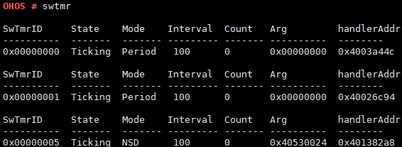

# swtmr

-   [Command Function](#section166171064814)
-   [Syntax](#section424011111682)
-   [Parameters](#section1268410459465)
-   [Usage](#section169806213815)
-   [Example](#section16676026389)
-   [Output](#section1541991614710)

## Command Function

This command is used to query information about system software timers.

## Syntax

swtmr \[_ID_\]

## Parameters

**Table  1**  Parameter description

<table><thead align="left"><tr id="row523mcpsimp"><th class="cellrowborder" valign="top" width="21%" id="mcps1.2.4.1.1">
Parameter

</th>
<th class="cellrowborder" valign="top" width="52%" id="mcps1.2.4.1.2">
Description

</th>
<th class="cellrowborder" valign="top" width="27%" id="mcps1.2.4.1.3">
Value Range

</th>
</tr>
</thead>
<tbody><tr id="row530mcpsimp"><td class="cellrowborder" valign="top" width="21%" headers="mcps1.2.4.1.1 ">
ID

</td>
<td class="cellrowborder" valign="top" width="52%" headers="mcps1.2.4.1.2 ">
Specifies the ID of a software timer.

</td>
<td class="cellrowborder" valign="top" width="27%" headers="mcps1.2.4.1.3 ">
[0,0xFFFFFFFF]

</td>
</tr>
</tbody>
</table>

## Usage

-   If no parameter is specified, information about all software timers is displayed.
-   If the  **ID**  parameter is specified, information about the specified software timer is displayed.

## Example

Run  **swtmr**  and  **swtmr 1**.

## Output

**Figure  1**  Querying information about all software timers  

**Figure  2**  Querying information about software timer 1  

**Table  2**  Output

<table><thead align="left"><tr id="row556mcpsimp"><th class="cellrowborder" valign="top" width="50%" id="mcps1.2.3.1.1">
Parameter

</th>
<th class="cellrowborder" valign="top" width="50%" id="mcps1.2.3.1.2">
Description

</th>
</tr>
</thead>
<tbody><tr id="row561mcpsimp"><td class="cellrowborder" valign="top" width="50%" headers="mcps1.2.3.1.1 ">
SwTmrID

</td>
<td class="cellrowborder" valign="top" width="50%" headers="mcps1.2.3.1.2 ">
ID of the software timer

</td>
</tr>
<tr id="row566mcpsimp"><td class="cellrowborder" valign="top" width="50%" headers="mcps1.2.3.1.1 ">
State

</td>
<td class="cellrowborder" valign="top" width="50%" headers="mcps1.2.3.1.2 ">
Status of the software timer

The value can be <strong id="b164905263633836">UnUsed</strong>, <strong id="b138979237833836">Created</strong>, or <strong id="b3849463233836">Ticking</strong>.

</td>
</tr>
<tr id="row571mcpsimp"><td class="cellrowborder" valign="top" width="50%" headers="mcps1.2.3.1.1 ">
Mode

</td>
<td class="cellrowborder" valign="top" width="50%" headers="mcps1.2.3.1.2 ">
Mode of the software timer

The value can be <strong id="b201632419733836">Once</strong>, <strong id="b45281151733836">Period</strong>, or <strong id="b73443815433836">NSD</strong> (one-shot timer that will not be automatically deleted after the timer has expired).

</td>
</tr>
<tr id="row576mcpsimp"><td class="cellrowborder" valign="top" width="50%" headers="mcps1.2.3.1.1 ">
Interval

</td>
<td class="cellrowborder" valign="top" width="50%" headers="mcps1.2.3.1.2 ">
Number of ticks used by the software timer

</td>
</tr>
<tr id="row581mcpsimp"><td class="cellrowborder" valign="top" width="50%" headers="mcps1.2.3.1.1 ">
Count

</td>
<td class="cellrowborder" valign="top" width="50%" headers="mcps1.2.3.1.2 ">
Number of times that the software timer has been used

</td>
</tr>
<tr id="row586mcpsimp"><td class="cellrowborder" valign="top" width="50%" headers="mcps1.2.3.1.1 ">
Arg

</td>
<td class="cellrowborder" valign="top" width="50%" headers="mcps1.2.3.1.2 ">
Input parameter passed

</td>
</tr>
<tr id="row591mcpsimp"><td class="cellrowborder" valign="top" width="50%" headers="mcps1.2.3.1.1 ">
handlerAddr

</td>
<td class="cellrowborder" valign="top" width="50%" headers="mcps1.2.3.1.2 ">
Callback address

</td>
</tr>
</tbody>
</table>

> **NOTE:** 
>-   The  **ID**  value can be in decimal or hexadecimal format.
>-   If the  **ID**  value is within the range of \[0,  _Number of current software timers - 1_\], the status of the specified software timer is returned. For other values, an error message is displayed.

