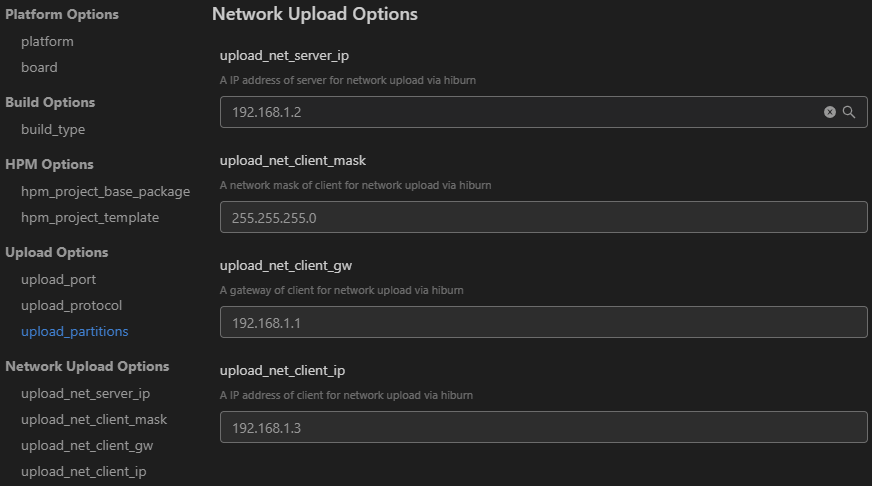

# Burning Images

-   [Prerequisites](#section232415263110)
    -   [Programming Flash Memory Through the Network Port](#section998903784810)

Programming flash memory of a regular system requires DevEco Device Tool v2.2 Beta1 or later.

Hi3516D V300 supports programming flash memory of the standard system through the USB port, network port, or serial port, where:

-   **Windows system: Supports programming through the USB port, serial port, or network port**
-   **Linux system: Supports programming through the network port or serial port**

Except for environment setup, the operations of programming are the same for Windows and Linux.

> **NOTE:** 
>Currently, the Hi3516D V300 development board supports system burning over the network port, USB port, or serial port. This document uses the network port as an example. For details about system burning over other ports, see  [Programming Flash Memory on Hi3516D V300](https://device.harmonyos.com/en/docs/ide/user-guides/hi3516_upload-0000001052148681).

## Prerequisites

In DevEco Device Tool, select  **Import Project**  to open the folder where the target file is located. Set  **MCU**  to  **Hi3516DV300**  under  **HiSilicon\_Arm\_Linux**  and  **Framework**  to  **Hb**.

### Programming Flash Memory Through the Network Port

The Hi3516DV300 supports programming through the network port in Windows or Linux.

1.  Connect the PC and the target development board through the serial port, network port, and power port. For details, see  [Introduction to the Hi3516 Development Board](https://device.harmonyos.com/en/docs/start/introduce/oem_minitinier_des_3516-0000001152041033).
2.  Open Device Manager, then check and record the serial port number corresponding to the development board.

    > **NOTE:** 
    >If the serial port number is not displayed correctly, follow the steps described in  [Installing the Serial Port Driver on the Hi3516 or Hi3518 Series Development Boards](https://device.harmonyos.com/en/docs/ide/user-guides/hi3516_hi3518-drivers-0000001050743695).

    

3.  Open DevEco Device Tool and go to  **Projects**  \>  **Settings**.

    

4.  On the  **hi3516dv300**  tab page, configure the programming options.

    -   **upload\_port**: Select the serial port number obtained in step  [2](#en-us_topic_0000001056443961_li1050616379507).
    -   **upload\_protocol**: Select the programming protocol  **hiburn-net**.
    -   **upload\_partitions**: Select the files to be burnt. By default,  **fastboot**,  **boot**,  **updater**,  **misc**,  **system**,  **vendor**, and  **userdata**  are burnt at the same time.

    

5.  Check and set the IP address of the network adapter connected to the development board. For details, see  [Setting the IP Address of the Network Port for Programming on Hi3516](https://device.harmonyos.com/en/docs/ide/user-guides/set_ipaddress-0000001141825075).
6.  Set the IP address of the network port for programming:

    -   **upload\_net\_server\_ip**: Select the IP address set in step  [6](en-us_topic_0000001056443961.md#li1558813168234), such as 192.168.1.2.
    -   **upload\_net\_client\_mask**: Set the subnet mask of the development board, such as 255.255.255.0. Once the  **upload\_net\_server\_ip**  field is set, this field will be automatically populated.
    -   **upload\_net\_client\_gw**: Set the gateway of the development board, such as 192.168.1.1. Once the  **upload\_net\_server\_ip**  field is set, this field will be automatically populated. 
    -   **upload\_net\_client\_ip**: Set the IP address of the development board, such as 192.168.1.3. Once the  **upload\_net\_server\_ip**  field is set, this field will be automatically populated. 

    

7.  When you finish modifying, click  **Save**  in the upper right corner.
8.  When the following message is displayed, power off the development board and then power it on.

    

9.  Start programming. If the following message is displayed, it indicates that the programming is successful.

    

