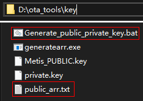
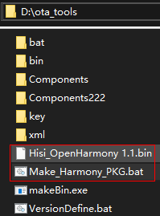

# OTA Upgrade<a name="EN-US_TOPIC_0000001052170816"></a>

-   [Limitations and Constraints](#section691733275418)
-   [Generating a Public/Private Key Pair](#section94411533155010)
-   [Generating an Upgrade Package](#section632383718539)
-   [Uploading the Upgrade Package](#section5772112473213)
-   [Downloading the Upgrade Package](#section251732474917)
-   [Integrating OTA Update Capabilities](#section298217330534)
-   [API Application Scenario \(Default\)](#section7685171192916)
    -   [How to Develop](#section0745926153017)
    -   [Sample Code](#section1337111363306)

-   [API Application Scenario \(Custom\)](#section1686395317306)
    -   [How to Develop](#section524515314317)
    -   [Sample Code](#section525974743120)

-   [Upgrading the System](#section151997114334)

Over the Air \(OTA\) is a technology that makes it easier for you to remotely update devices, such as IP cameras. A device can be upgraded with a full or differential package. A full package contains all content of a new system, and a differential package contains the differences between the old and new systems. Currently, only the full-package upgrade is supported.

## Limitations and Constraints<a name="section691733275418"></a>

-   The open-source suites for devices developed based on Hi3861, Hi3518E V300 and Hi3516D V300 are supported.
-   Devices developed based on Hi3518E V300 and Hi3516D V300 must support the SD card in the Virtual Festival of Aerobatic Teams \(VFAT\) format.

## Generating a Public/Private Key Pair<a name="section94411533155010"></a>

1.  Download the OpenSSL tool from the following website and install it on a Windows PC, and configure environment variables.

    [http://slproweb.com/products/Win32OpenSSL.html](http://slproweb.com/products/Win32OpenSSL.html)

2.  Access the  **tools\\update\_tools\\update\_pkg\_tools**  directory, download the upgrade package making tool, and save it to a local directory, for example,  **D:\\ota\_tools**.
3.  Run  **Generate\_public\_private\_key.bat**  in the  **ota\_tools\\key**  directory to generate  **Metis\_PUBLIC.key**,  **private.key**, and  **public\_arr.txt**  that contains public values, as shown in the following figure. Keep the private key properly.

    **Figure  1**  Generating a Public/Private Key Pair<a name="fig12913135294011"></a>  
    

    

4.  Use the array written in  **public\_arr.txt**  as a substitute for  **g\_pubKeyBuf**  in  **base\\update\\ota\_lite\\frameworks\\source\\verify\\hota\_verify.c**  of the OTA module.

    Example array in  **public\_arr.txt**:

    ```
    0x30,0x82,0x1,0xa,0x2,0x82,0x1,0x1,0x0,0xc7,0x8c,0xf3,0x91,0xa1,0x98,0xbf,0xb1,0x8c,
    0xbe,0x22,0xde,0x32,0xb2,0xfa,0xec,0x2c,0x69,0xf6,0x8f,0x43,0xa7,0xb7,0x6f,0x1e,0x4a,0x97,
    0x4b,0x27,0x5d,0x56,0x33,0x9a,0x73,0x4e,0x7c,0xf8,0xfd,0x1a,0xf0,0xe4,0x50,0xda,0x2b,0x8,
    0x74,0xe6,0x28,0xcc,0xc8,0x22,0x1,0xa8,0x14,0x9,0x46,0x46,0x6a,0x10,0xcd,0x39,0xd,0xf3,
    0x4a,0x7f,0x1,0x63,0x21,0x33,0x74,0xc6,0x4a,0xeb,0x68,0x40,0x55,0x3,0x80,0x1d,0xd9,0xbc,
    0xd4,0xb0,0x4a,0x84,0xb7,0xac,0x43,0x1d,0x76,0x3a,0x61,0x40,0x23,0x3,0x88,0xcc,0x80,0xe,
    0x75,0x10,0xe4,0xad,0xac,0xb6,0x4c,0x90,0x8,0x17,0x26,0x21,0xff,0xbe,0x1,0x82,0x16,0x76,
    0x9a,0x1c,0xee,0x8e,0xd9,0xb0,0xea,0xd5,0x50,0x61,0xcc,0x9c,0x2e,0x78,0x15,0x2d,0x1f,0x8b,
    0x94,0x77,0x30,0x39,0x70,0xcf,0x16,0x22,0x82,0x99,0x7c,0xe2,0x55,0x37,0xd4,0x76,0x9e,0x4b,
    0xfe,0x48,0x26,0xc,0xff,0xd9,0x59,0x6f,0x77,0xc6,0x92,0xdd,0xce,0x23,0x68,0x83,0xbd,0xd4,
    0xeb,0x5,0x1b,0x2a,0x7e,0xda,0x9a,0x59,0x93,0x41,0x7b,0x4d,0xef,0x19,0x89,0x4,0x8d,0x5,
    0x7d,0xbc,0x3,0x1f,0x77,0xe6,0x3d,0xa5,0x32,0xf5,0x4,0xb7,0x9c,0xe9,0xfa,0x6e,0xc,0x9f,
    0x4,0x62,0xfe,0x2a,0x5f,0xbf,0xeb,0x9a,0x73,0xa8,0x2a,0x72,0xe3,0xf0,0x57,0x56,0x5c,0x59,
    0x14,0xdd,0x79,0x11,0x42,0x3a,0x48,0xf7,0xe8,0x80,0xb1,0xaf,0x1c,0x40,0xa2,0xc6,0xec,0xf5,
    0x67,0xc1,0x88,0xf6,0x26,0x5c,0xd3,0x11,0x5,0x11,0xed,0xb1,0x45,0x2,0x3,0x1,0x0,0x1,
    ```

    Example configuration for the public key of the OTA module:

    ```
    #define PUBKEY_LENGTH 270
    
    static uint8 g_pubKeyBuf[PUBKEY_LENGTH] = {
        0x30, 0x82, 0x01, 0x0A, 0x02, 0x82, 0x01, 0x01, 0x00, 0xBF, 0xAA, 0xA5, 0xB3, 0xC2, 0x78, 0x5E,
        0x63, 0x07, 0x84, 0xCF, 0x37, 0xF0, 0x45, 0xE8, 0xB9, 0x6E, 0xEF, 0x04, 0x88, 0xD3, 0x43, 0x06,
    ```

5.  \(Optional\) For Hi3518E V300 and Hi3516D V300 suites, further replace the array written in  **g\_pub\_key**  with that in  **public\_arr.txt**. The  **g\_pub\_key**  file is provided in  **device\\hisilicon\\third\_party\\uboot\\u-boot-2020.01\\product\\hiupdate\\verify\\update\_public\_key.c**  of the U-Boot module.

    Example configuration for the public key of the U-Boot module:

    ```
    static unsigned char g_pub_key[PUBKEY_LEN] = {
    	0x30, 0x82, 0x01, 0x0A, 0x02, 0x82, 0x01, 0x01,
    	0x00, 0xBF, 0xAA, 0xA5, 0xB3, 0xC2, 0x78, 0x5E,
    ```


## Generating an Upgrade Package<a name="section632383718539"></a>

1.  Save the files to be upgraded in the  **ota\_tools\\Components**  directory.

    **Figure  2**  Location of original image files<a name="fig98691649182817"></a>  
    

    

    **Table  1**  Files to be upgraded

    <a name="table49058318812"></a>
    <table><thead align="left"><tr id="row16905131385"><th class="cellrowborder" valign="top" width="18.790000000000003%" id="mcps1.2.3.1.1"><p id="p390543111811"><a name="p390543111811"></a><a name="p390543111811"></a>File</p>
    </th>
    <th class="cellrowborder" valign="top" width="81.21000000000001%" id="mcps1.2.3.1.2"><p id="p139066318815"><a name="p139066318815"></a><a name="p139066318815"></a>Description</p>
    </th>
    </tr>
    </thead>
    <tbody><tr id="row3906631180"><td class="cellrowborder" valign="top" width="18.790000000000003%" headers="mcps1.2.3.1.1 "><p id="p14906331987"><a name="p14906331987"></a><a name="p14906331987"></a>u-boot.bin</p>
    </td>
    <td class="cellrowborder" valign="top" width="81.21000000000001%" headers="mcps1.2.3.1.2 "><p id="p11368820172317"><a name="p11368820172317"></a><a name="p11368820172317"></a>Renamed from the <strong id="b996114032518"><a name="b996114032518"></a><a name="b996114032518"></a>u-boot-hi351XevX00.bin</strong> file generated after compilation.</p>
    </td>
    </tr>
    <tr id="row775316253222"><td class="cellrowborder" valign="top" width="18.790000000000003%" headers="mcps1.2.3.1.1 "><p id="p14753102517226"><a name="p14753102517226"></a><a name="p14753102517226"></a>kernel.bin</p>
    </td>
    <td class="cellrowborder" valign="top" width="81.21000000000001%" headers="mcps1.2.3.1.2 "><p id="p675362582216"><a name="p675362582216"></a><a name="p675362582216"></a>Renamed from the <strong id="b4150615191011"><a name="b4150615191011"></a><a name="b4150615191011"></a>liteos.bin</strong> or <strong id="b115001531019"><a name="b115001531019"></a><a name="b115001531019"></a>kernel</strong> file generated after compilation.</p>
    </td>
    </tr>
    <tr id="row2171010122214"><td class="cellrowborder" valign="top" width="18.790000000000003%" headers="mcps1.2.3.1.1 "><p id="p2017171022212"><a name="p2017171022212"></a><a name="p2017171022212"></a>rootfs.img</p>
    </td>
    <td class="cellrowborder" valign="top" width="81.21000000000001%" headers="mcps1.2.3.1.2 "><p id="p618310192211"><a name="p618310192211"></a><a name="p618310192211"></a>Renamed from the <strong id="b168991949142619"><a name="b168991949142619"></a><a name="b168991949142619"></a>rootfs_xxxxx.img</strong> file generated after compilation.</p>
    </td>
    </tr>
    <tr id="row1499631732214"><td class="cellrowborder" valign="top" width="18.790000000000003%" headers="mcps1.2.3.1.1 "><p id="p999617175226"><a name="p999617175226"></a><a name="p999617175226"></a>config</p>
    </td>
    <td class="cellrowborder" valign="top" width="81.21000000000001%" headers="mcps1.2.3.1.2 "><p id="p199621712227"><a name="p199621712227"></a><a name="p199621712227"></a>Provides development board and kernel information. For details, see the SD card burning description of the corresponding open-source suite.</p>
    </td>
    </tr>
    <tr id="row8996101712222"><td class="cellrowborder" valign="top" width="18.790000000000003%" headers="mcps1.2.3.1.1 "><p id="p4996141772214"><a name="p4996141772214"></a><a name="p4996141772214"></a>OTA.tag</p>
    </td>
    <td class="cellrowborder" valign="top" width="81.21000000000001%" headers="mcps1.2.3.1.2 "><p id="p1735535514293"><a name="p1735535514293"></a><a name="p1735535514293"></a>Contains 32 bytes in the <strong id="b1017052314336"><a name="b1017052314336"></a><a name="b1017052314336"></a>package_type:otaA1S2D3F4G5H6J7K8</strong> format. The last 16 bytes are random, varying with the version.</p>
    </td>
    </tr>
    </tbody>
    </table>

2.  Open the  **packet\_harmony.xml**  file in  **ota\_tools\\xml**  to modify  **compAddr**  as follows. Other items are reserved.

    Example configuration for the component information:

    ```
        <group name="own">
            <list>
                <component compAddr="rootfs" compId="0x0017" resType="0x05" isDelete="0x00" compType ="0x00" compVer="1.0">.\Components\rootfs_jffs2.img</component>
    			<component compAddr="kernel_A" compId="0x0018" resType="0x05" isDelete="0x00" compType ="0x00" compVer="1.1">.\Components\liteos.bin</component>
    			<component compAddr="data" compId="0x0019" resType="0x05" isDelete="0x00" compType ="0x00" compVer="1.2">.\Components\userfs_jffs2.img</component>
            </list>
    ```

3.  Configure the paths of private and public keys in  **packet\_harmony.xml**.

    Example configuration for paths of private and public keys:

    ```
    <encryption>
        <privateKey type="der">.\key\private.key</privateKey>
        <publicKey type="der">.\key\Metis_PUBLIC.key</publicKey>
    </encryption>
    ```

4.  Configure the product name and software version in  **ota\_tools\\VersionDefine.bat**  for anti-rollback.

    Example configuration for the product name and software version:

    ```
    set FILE_PRODUCT_NAME=Hisi
    
    @rem Set the software version number to a string of no more than 16 characters.
    set SOFTWARE_VER=OpenHarmony 1.1 
    ```

5.  Run  **Make\_Harmony\_PKG.bat**  in the  **ota\_tools**  directory to generate the  **Hisi\_OpenHarmony 1.1.bin**  upgrade package. The upgrade package is signed using  **SHA-256**  and  **RSA 2048**  to ensure its integrity and validity.

    **Figure  3**  Upgrade package making tool<a name="fig046712449315"></a>  
    

    


## Uploading the Upgrade Package<a name="section5772112473213"></a>

Upload the  **Hisi\_OpenHarmony 1.1.bin**  upgrade package to the vendor's OTA server.

## Downloading the Upgrade Package<a name="section251732474917"></a>

1.  Download the  **Hisi\_OpenHarmony 1.1.bin**  upgrade package from the OTA server.
2.  \(Optional\) Insert an SD card \(capacity greater than 100 MB\) if the device is developed based on Hi3518E V300 or Hi3516D V300.

## Integrating OTA Update Capabilities<a name="section298217330534"></a>

-   If vendors request OTA capabilities, use the dynamic library  **libhota.so**  and include the header files  **hota\_partition.h**  and  **hota\_updater.h**  in  **base\\update\\ota\_lite\\interfaces\\kits**.
-   The  **libhota.so**  source code is stored in  **base\\update\\ota\_lite\\frameworks\\source**.
-   For details about how to use APIs, see  [API Application Scenario \(Default\)](#section7685171192916)  and OTA APIs in  _API Reference_.
-   If the development board needs to be adapted, see the  **base\\update\\ota\_lite\\hals\\hal\_hota\_board.h**  header file.

## API Application Scenario \(Default\)<a name="section7685171192916"></a>

The upgrade package is generated by following the instructions provided in  [Generating a Public/Private Key Pair](#section94411533155010)  and  [Generating an Upgrade Package](#section632383718539).

### **How to Develop**<a name="section0745926153017"></a>

1.  Download the upgrade package for the current device, and then call the  **HotaInit**  function to initialize the OTA module.
2.  Call the  **HotaWrite**  function to verify, parse, and write data streams into the device.
3.  Call the  **HotaRestart**  function to restart the system.

    If you want to cancel the upgrade, call the  **HotaCancel**  function.


### **Sample Code**<a name="section1337111363306"></a>

Perform an OTA update using the upgrade package format and verification method provided by OpenHarmony.

```
int main(int argc, char **argv)
{
    printf("this is update print!\r\n");
    if (HotaInit(NULL, NULL) < 0) {
        printf("ota update init fail!\r\n");
        return -1;
    }
    int fd = open(OTA_PKG_FILE, O_RDWR, S_IRUSR | S_IWUSR);
    if (fd < 0) {
        printf("file open failed, fd = %d\r\n", fd);
        (void)HotaCancel();
        return -1;
    }
    int offset = 0;
    int fileLen = lseek(fd, 0, SEEK_END);
    int leftLen = fileLen;
    while (leftLen > 0) {
        if (lseek(fd, offset, SEEK_SET) < 0) {
            close(fd);
            printf("lseek fail!\r\n");
            (void)HotaCancel();
            return -1;
        }
        int tmpLen = leftLen >= READ_BUF_LEN ? READ_BUF_LEN : leftLen;
        (void)memset_s(g_readBuf, READ_BUF_LEN, 0, READ_BUF_LEN);
        if (read(fd, g_readBuf, tmpLen) < 0) {
            close(fd);
            printf("read fail!\r\n");
            (void)HotaCancel();
            return -1;
        }
        if (HotaWrite((unsigned char *)g_readBuf, offset, tmpLen) != 0) {
            printf("ota write fail!\r\n");
            close(fd);
            (void)HotaCancel();
            return -1;
        }
        offset += READ_BUF_LEN;
        leftLen -= tmpLen;
    }
    close(fd);
    printf("ota write finish!\r\n");
    printf("device will reboot in 10s...\r\n");
    sleep(10);
    (void)HotaRestart();
    return 0;
}
```

## API Application Scenario \(Custom\)<a name="section1686395317306"></a>

The upgrade package is generated in other ways instead of by referring to the preceding two sections.

### **How to Develop**<a name="section524515314317"></a>

1.  Download the upgrade package for the current device, and then call the  **HotaInit**  function to initialize the OTA module.
2.  Call the  **HotaSetPackageType**  function to set the package type to  **NOT\_USE\_DEFAULT\_PKG**.
3.  Call the  **HotaWrite**  function to write data streams into the device.
4.  Call the  **HotaRead**  function to read data. Vendors can choose to verify the data.
5.  \(Optional\) Call the  **HotaSetBootSettings**  function to set the startup tag used for entering the U-Boot mode after restarting the system.
6.  Call the  **HotaRestart**  function to restart the system.

    If you want to cancel the upgrade, call the  **HotaCancel**  function.


### **Sample Code**<a name="section525974743120"></a>

Perform an OTA update using the upgrade package format and verification method not provided by OpenHarmony.

```
int main(int argc, char **argv)
{
    printf("this is update print!\r\n");
    if (HotaInit(NULL, NULL) < 0) {
        printf("ota update init fail!\r\n");
        (void)HotaCancel();
        return -1;
    }
    (void)HotaSetPackageType(NOT_USE_DEFAULT_PKG);
    int fd = open(OTA_PKG_FILE, O_RDWR, S_IRUSR | S_IWUSR);
    if (fd < 0) {
        printf("file open failed, fd = %d\r\n", fd);
        (void)HotaCancel();
        return -1;
    }
    int offset = 0;
    int fileLen = lseek(fd, 0, SEEK_END);
    int leftLen = fileLen;
    while (leftLen > 0) {
        if (lseek(fd, offset, SEEK_SET) < 0) {
            close(fd);
            printf("lseek fail!\r\n");
            (void)HotaCancel();
            return -1;
        }
        int tmpLen = leftLen >= READ_BUF_LEN ? READ_BUF_LEN : leftLen;
        (void)memset_s(g_readBuf, READ_BUF_LEN, 0, READ_BUF_LEN);
        if (read(fd, g_readBuf, tmpLen) < 0) {
            close(fd);
            printf("read fail!\r\n");
            (void)HotaCancel();
            return -1;
        }
        if (HotaWrite((unsigned char *)g_readBuf, offset, tmpLen) != 0) {
            printf("ota write fail!\r\n");
            close(fd);
            (void)HotaCancel();
            return -1;
        }
        offset += READ_BUF_LEN;
        leftLen -= tmpLen;
    }
    close(fd);
    printf("ota write finish!\r\n");
    leftLen = fileLen;
    while (leftLen > 0) {
        int tmpLen = leftLen >= READ_BUF_LEN ? READ_BUF_LEN : leftLen;
        (void)memset_s(g_readBuf, READ_BUF_LEN, 0, READ_BUF_LEN);
        if (HotaRead(offset, READ_BUF_LEN, (unsigned char *)g_readBuf) != 0) {}
            printf("ota write fail!\r\n");
            (void)HotaCancel();
            return -1;
        }
        /* do your verify and parse */
        offset += READ_BUF_LEN;
        leftLen -= tmpLen;
    }
    /* set your boot settings */
    (void)HotaSetBootSettings();
    printf("device will reboot in 10s...\r\n");
    sleep(10);
    (void)HotaRestart();
    return 0;
}
```

## Upgrading the System<a name="section151997114334"></a>

Vendor applications call APIs of the OTA module to perform functions such as signature verification of the upgrade package, anti-rollback, burning and data flushing-to-disk. After the upgrade is complete, the system automatically restarts.

For Hi3518E V300 and Hi3516D V300 open-source suites, the value of  **LOCAL\_VERSION**  needs to be modified for anti-rollback, for example, modifying  **ohos default 1.0**  to  **ohos default 1.1**. The macro  **LOCAL\_VERSION**  is provided in  **device\\hisilicon\\third\_party\\uboot\\u-boot-2020.01\\product\\hiupdate\\ota\_update\\ota\_local\_info.c**.

Example for modification of the local version:

```
const char *get_local_version(void)
{
#if defined(CONFIG_TARGET_HI3516EV200) || \
	defined(CONFIG_TARGET_HI3516DV300) || \
	defined(CONFIG_TARGET_HI3518EV300)
#define LOCAL_VERSION "ohos default 1.0" /* increase: default release version */
```

