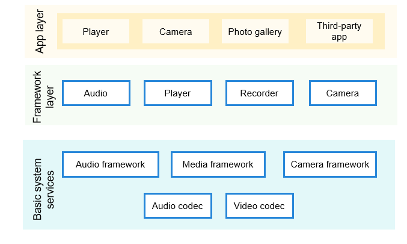
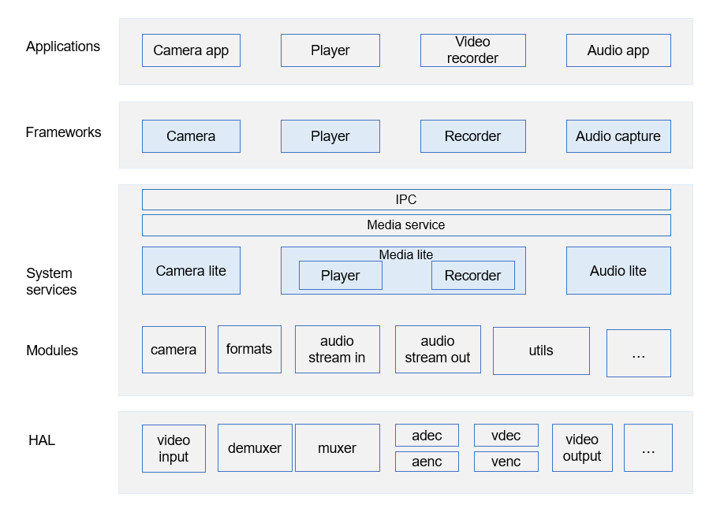

# Multimedia<a name="EN-US_TOPIC_0000001078026808"></a>

-   [Introduction](#section11660541593)
-   [Directory Structure](#section161941989596)
-   [Constraints](#section119744591305)
-   [Usage Guidelines](#section1312121216216)
-   [Installation](#section11914418405)
-   [Repositories Involved](#section1371113476307)

## Introduction<a name="section11660541593"></a>

The multimedia subsystem provides a set of simple and easy-to-use APIs for you to access the system and media resources.

This subsystem offers various media services covering audio, videos, and cameras, which provide the following capabilities:

-   Audio playback and recording
-   Video playback and recording

-   Photographing and recording \(with cameras\)

## Architecture<a name="section11660541594"></a>

**Figure  1**  Common architecture of the multimedia subsystem<a name="fig13371156141412"></a>  




**Figure  2**  Architecture of the multimedia subsystem suitable for the small system<a name="fig866802061417"></a>  




**Figure  3**  Multimedia service flow for the small system<a name="fig1334042801419"></a>  


## Directory Structure<a name="section161941989596"></a>

The structure of the repository directory is as follows:

```
/foundation/multimedia                                 # Service code
├── audio_lite                                         # Audio module for the small system
│   ├── figures                                        # Architecture and process figures of the audio module for the small system
│   ├── frameworks                                     # Audio framework implementation for the small system
│   └── interfaces                                     # Audio module APIs for the small system
├── audio_standard                                     # Audio module for the standard system
│   ├── figures                                        # Architecture and process figures of the audio module for the standard system
│   ├── frameworks                                     # Audio framework implementation for the standard system
│   ├── interfaces                                     # Audio module APIs for the standard system
│   ├── sa_profile                                     # Audio service profile for the standard system
│   └── services                                       # Audio service implementation for the standard system
├── camera_lite                                        # Camera module for the small system
│   ├── figures                                        # Architecture and process figures of the camera module for the small system
│   ├── frameworks                                     # Camera framework implementation for the small system
│   └── interfaces                                     # Camera module APIs for the small system
├── camera_standard                                    # Camera module for the standard system
│   ├── figures                                        # Architecture and process figures of the camera module for the standard system
│   ├── frameworks                                     # Camera framework implementation for the standard system
│   └── interfaces                                     # Camera module APIs for the standard system
├── media_lite                                         # Playback and recording module for the small system
│   ├── figures                                        # Architecture and process figures of the playback and recording module for the small system
│   ├── frameworks                                     # Playback and recording framework implementation for the small system
│   ├── interfaces                                     # Playback and recording module APIs for the small system
│   └── services                                       # Playback and recording service implementation for the small system
├── media_standard                                     # Playback and recording module for the standard system
│   ├── figures                                        # Architecture and process figures of the playback and recording module for the standard system
│   ├── frameworks                                     # Playback and recording framework implementation for the standard system
│   └── interfaces                                     # Playback and recording module APIs for the standard system
└── utils                                              # Subsystem utility module
    └── lite                                           # Utility module for the small system
        ├── figures                                    # Architecture and process figures of the utility module for the small system
        ├── hals                                       # Hardware abstraction interfaces of the subsystem for the small system
        ├── interfaces                                 # Utility module APIs for the standard system
        └── src                                        # Utility module framework implementation for the small system
```

## Constraints<a name="section119744591305"></a>

Hardware-based decoding and encoding functions of audio and video data are device-specific.

## Usage Guidelines<a name="section1312121216216"></a>

You can use the APIs in any of the provided classes based on your development requirements.

-   For details about how to call media APIs to implement the video recording, preview, and playback, see  [Multimedia Development Guide](https://gitee.com/openharmony/docs/blob/master/en/device-dev/subsystems/subsys-multimedia.md).
-   For a simple player, use  **Player**  and  **Recorder**  classes to quickly implement the playback and recording features.
-   The  **CameraKit**  class provides a group of effective methods for controlling a camera, which facilitates the camera development.
-   You can create a  **CameraKit**  object and register various callbacks to respond to many events in the multimedia module. Then, create a  **Camera**  object to operate camera resources, for example, to start preview, recording, and stream capturing, and set related parameters.

## Installation<a name="section11914418405"></a>

Load the kernel and related drivers before installing the repository. For details, see readme files of kernel and driver subsystems.

## Repositories Involved<a name="section1371113476307"></a>

[multimedia\_camera\_lite](https://gitee.com/openharmony/multimedia_camera_lite)

[multimedia\_audio\_lite](https://gitee.com/openharmony/multimedia_audio_lite)

[multimedia\_media\_lite](https://gitee.com/openharmony/multimedia_media_lite)

[multimedia\_utils\_lite](https://gitee.com/openharmony/multimedia_utils_lite)

[multimedia\_camera\_standard](https://gitee.com/openharmony/multimedia_camera_standard)

[multimedia\_audio\_standard](https://gitee.com/openharmony/multimedia_audio_standard)

[multimedia\_media\_standard](https://gitee.com/openharmony/multimedia_media_standard)

