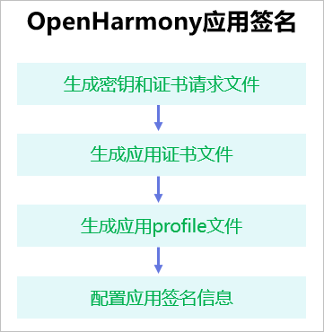

# 配置OpenHarmony应用签名信息<a name="ZH-CN_TOPIC_0000001159890371"></a>

-   [生成密钥和证书请求文件](#section153146467405)
-   [生成应用证书文件](#section136609429562)
-   [生成应用Profile文件](#section2048641015325)
-   [配置应用签名信息](#section10152423193310)

使用真机设备运行和调试OpenHarmony应用前，需要对应用进行签名才能正常运行。该指导用于OpenHarmony应用的签名配置。除此章节以外，DevEco Studio的其余操作指导无差别，具体请访问[HUAWEI DevEco Studio使用指南](https://developer.harmonyos.com/cn/docs/documentation/doc-guides/tools_overview-0000001053582387)。配置应用签名信息的流程如下图所示。



## 生成密钥和证书请求文件<a name="section153146467405"></a>

OpenHarmony应用通过数字证书（.cer文件）和Profile文件（.p7b文件）来保证应用的完整性，需要通过DevEco Studio来生成密钥文件（.p12文件）和证书请求文件（.csr文件）。同时，也可以使用命令行工具的方式来生成密钥文件和证书请求文件。具体操作请参考[生成密钥和证书请求文件](https://developer.harmonyos.com/cn/docs/documentation/doc-guides/publish_app-0000001053223745#section9752152162813)。

## 生成应用证书文件<a name="section136609429562"></a>

使用[生成密钥和证书请求文件](#section153146467405)中生成的证书请求文件，来生成应用签名所需的数字证书文件。生成方法如下：

进入DevEco Studio安装目录的**Sdk\\toolchains\\lib**文件夹下（该SDK目录只能是OpenHarmony SDK，配置方法可参考[配置OpenHarmony SDK](配置OpenHarmony-SDK.md)），打开命令行工具，执行如下命令（如果keytool命令不能执行，请在系统环境变量中添加JDK的环境变量）。其中，只需要修改输入和输出即可快速生成证书文件，即修改**-infile**指定证书请求文件csr文件路径，**-outfile**指定输出证书文件名及路径。

```
keytool -gencert -alias "OpenHarmony Application CA" -infile myApplication_ohos.csr -outfile myApplication_ohos.cer -keystore OpenHarmony.p12 -sigalg SHA384withECDSA -storepass 123456 -ext KeyUsage:"critical=digitalSignature" -validity  3650 -rfc
```

关于该命令的参数说明如下：

-   **alias**：用于签发证书的CA私钥别名，OpenHarmony社区CA私钥存于OpenHarmony.p12密钥库文件中，该参数不能修改。
-   **infile**：证书请求（CSR）文件的路径。
-   **outfile**：输出证书链文件名及路径。
-   **keystore**：签发证书的CA密钥库路径，OpenHarmony密钥库文件名为OpenHarmony.p12，文件在OpenHarmony SDK中**Sdk\\toolchains\\lib**路径下，该参数不能修改。请注意，该OpenHarmony.p12文件并不是[生成密钥和证书请求文件](#section153146467405)中生成的.p12文件。
-   **sigalg**：证书签名算法，该参数不能修改。
-   **storepass**：密钥库密码，密码为123456，该参数不能修改。
-   **ext**：证书扩展项，该参数不能修改。
-   **validity**：证书有效期，自定义天数。
-   **rfc**：输出文件格式指定，该参数不能修改。

## 生成应用Profile文件<a name="section2048641015325"></a>

Profile文件包含OpenHarmony应用的包名、数字证书信息、描述应用允许申请的证书权限列表，以及允许应用调试的设备列表（如果应用类型为Release类型，则设备列表为空）等内容，每个应用包中均必须包含一个Profile文件。

进入**Sdk\\toolchains\\lib**目录下，打开命令行工具，执行如下命令。

```
java -jar provisionsigtool.jar sign --in UnsgnedReleasedProfileTemplate.json --out myApplication_ohos_Provision.p7b --keystore OpenHarmony.p12 --storepass 123456 --alias "OpenHarmony Application Profile Release" --sigAlg SHA256withECDSA --cert OpenHarmonyProfileRelease.pem --validity 365 --developer-id ohosdeveloper --bundle-name 包名 --permission 受限权限名（可选） --permission 受限权限名（可选） --distribution-certificate myApplication_ohos.cer
```

关于该命令的参数说明如下：

-   **provisionsigtool**：Profile文件生成工具，文件在OpenHarmony SDK的**Sdk\\toolchains\\lib**路径下。
-   **in**：Profile模板文件所在路径，文件在OpenHarmony SDK中**Sdk\\toolchains\\lib**路径下，该参数不能修改。
-   **out**：输出的Profile文件名和路径。
-   **keystore**：签发证书的密钥库路径，OpenHarmony密钥库文件名为OpenHarmony.p12，文件在OpenHarmony SDK中**Sdk\\toolchains\\lib**路径下，该参数不能修改。
-   **storepass**：密钥库密码，密码为123456，该参数不能修改。
-   **alias**：用于签名Profile私钥别名，OpenHarmony社区CA私钥存于OpenHarmony.p12密钥库文件中，该参数不能修改。
-   **sigalg**：证书签名算法，该参数不能修改。
-   **cert**：签名Profile的证书文件路径，文件在OpenHarmony SDK中**Sdk\\toolchains\\lib**路径下，该参数不能修改。
-   **validity**：证书有效期，自定义天数。
-   **developer-id**：开发者标识符，自定义一个字符串。
-   **bundle-name**：填写应用包名。
-   **permission**：可选字段，如果不需要，则可以省去此字段；如果需要添加多个受限权限，则如示例所示重复输入。受限权限列表如下：ohos.permission.READ\_CONTACTS、ohos.permission.WRITE\_CONTACTS。
-   **distribution-certificate**：[生成应用证书文件](#section136609429562)中生成的证书文件。

## 配置应用签名信息<a name="section10152423193310"></a>

在真机设备上调试前，需要使用到制作的私钥（.p12）文件、证书（.cer）文件和Profile（.p7b）文件对调试的模块进行签名。

打开**File \> Project Structure**，点击**Project \> Signing Configs \> debug**窗口中，去除勾选“Automatically generate signing”，然后配置指定模块的调试签名信息。

-   **Store File**：选择密钥库文件，文件后缀为.p12，该文件为[生成密钥和证书请求文件](#section153146467405)中生成的.p12文件。
-   **Store Password**：输入密钥库密码，该密码为[生成密钥和证书请求文件](#section153146467405)中填写的密钥库密码保持一致。
-   **Key Alias**：输入密钥的别名信息，与[生成密钥和证书请求文件](#section153146467405)中填写的别名保持一致。
-   **Key Password**：输入密钥的密码，与**Store Password**保持一致。
-   **Sign Alg**：签名算法，固定为SHA256withECDSA。
-   **Profile File**：选择[生成应用Profile文件](#section2048641015325)中生成的Profile文件，文件后缀为.p7b。
-   **Certpath File**：选择[生成应用证书文件](#section136609429562)中生成的数字证书文件，文件后缀为.cer。


设置完签名信息后，点击**OK**进行保存，然后可以在工程下的build.gradle中查看签名的配置信息。


默认情况下，DevEco Studio编译hap包的类型为debug类型，如果需要编译release类型的hap包，请打开工程左下角的OhosBuild Variants，设置模块的编译构建类型为release。关于编译构建hap的详细说明请参考[HUAWEI DevEco Studio使用指南](https://developer.harmonyos.com/cn/docs/documentation/doc-guides/build_hap-0000001053342418)。


编译完成后，OpenHarmony应用的Hap包可以从工程的bulid目录下获取。


