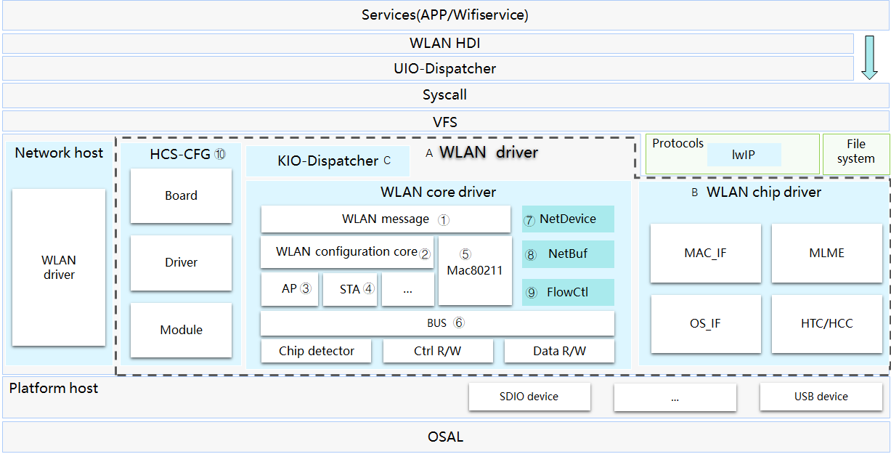
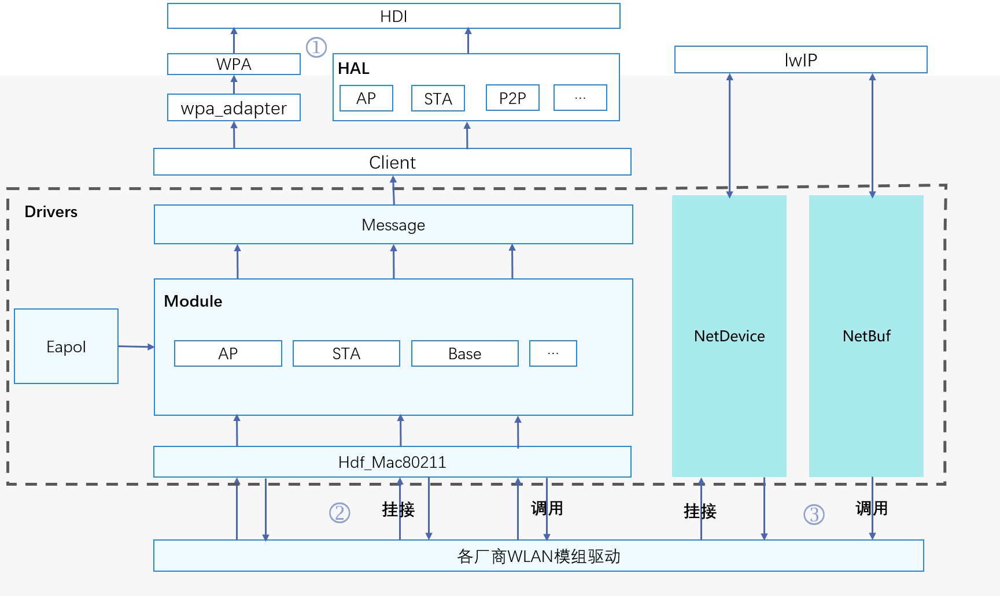

# WLAN<a name="ZH-CN_TOPIC_0000001051643558"></a>

-   [概述](#section729758162218)
    -   [WLAN驱动接口架构](#section178022416377)
    -   [接口说明](#section149681312202415)

-   [开发指导](#section15957746172412)
    -   [开发步骤](#section11776186132513)

-   [开发实例](#section1395253612512)

## 概述<a name="section729758162218"></a>

WLAN是基于HDF（Hardware Driver Foundation）驱动框架开发的模块，该模块可实现跨操作系统迁移，自适应器件差异，模块化拼装编译等功能。各WLAN厂商驱动开发人员可根据WLAN模块提供的向下统一接口适配各自的驱动代码，实现如下能力：建立/关闭WLAN热点、扫描、关联WLAN热点等；对HDI层向上提供能力如下：设置MAC地址、设置发射功率、获取设备的MAC地址等。[WLAN模块框架图](#fig967034316227)如下：

**图 1**  WLAN框架<a name="fig967034316227"></a>  




### WLAN驱动接口架构<a name="section178022416377"></a>

WLAN模块有三部分对外开放的API接口，如[下图2](#fig15016395217)所示：

1. 对HDI层提供的能力接口。

2. 驱动直接调用WLAN模块能力接口。

3. 提供给各厂商实现的能力接口。

**图 2**  WLAN模块开放能力分布图<a name="fig15016395217"></a>  




### 接口说明<a name="section149681312202415"></a>

WLAN驱动模块提供给驱动开发人员可直接调用的能力接口，主要功能有：创建/释放WifiModule、关联/取消关联、申请/释放NetBuf、lwip的pbuf和NetBuf的相互转换等。提供的部分接口说明如[表1](#table1521573319472)所示：

**表 1**  可直接调用的接口

<a name="table1521573319472"></a>
<table><thead align="left"><tr id="row121519334474"><th class="cellrowborder" valign="top" width="15.079999999999998%" id="mcps1.2.4.1.1"><p id="p1221510339475"><a name="p1221510339475"></a><a name="p1221510339475"></a>头文件</p>
</th>
<th class="cellrowborder" valign="top" width="60.33%" id="mcps1.2.4.1.2"><p id="p0215153344716"><a name="p0215153344716"></a><a name="p0215153344716"></a>接口名称</p>
</th>
<th class="cellrowborder" valign="top" width="24.59%" id="mcps1.2.4.1.3"><p id="p1421503315478"><a name="p1421503315478"></a><a name="p1421503315478"></a>功能描述</p>
</th>
</tr>
</thead>
<tbody><tr id="row112150333476"><td class="cellrowborder" rowspan="4" valign="top" width="15.079999999999998%" headers="mcps1.2.4.1.1 "><p id="p2155710125317"><a name="p2155710125317"></a><a name="p2155710125317"></a>wifi_module.h</p>
<p id="p189132019183"><a name="p189132019183"></a><a name="p189132019183"></a></p>
</td>
<td class="cellrowborder" valign="top" width="60.33%" headers="mcps1.2.4.1.2 "><p id="p363110387399"><a name="p363110387399"></a><a name="p363110387399"></a>struct WifiModule *WifiModuleCreate(const struct HdfConfigWifiModuleConfig *config);</p>
</td>
<td class="cellrowborder" valign="top" width="24.59%" headers="mcps1.2.4.1.3 "><p id="p1363012387393"><a name="p1363012387393"></a><a name="p1363012387393"></a>基于HDF开发WLAN驱动时，创建一个WifiModule。</p>
</td>
</tr>
<tr id="row112151233194714"><td class="cellrowborder" valign="top" headers="mcps1.2.4.1.1 "><p id="p7629163817393"><a name="p7629163817393"></a><a name="p7629163817393"></a>void WifiModuleDelete(struct WifiModule *module);</p>
</td>
<td class="cellrowborder" valign="top" headers="mcps1.2.4.1.2 "><p id="p2627638173917"><a name="p2627638173917"></a><a name="p2627638173917"></a>基于HDF开发WLAN驱动时，删除并释放WifiModule所有数据。</p>
</td>
</tr>
<tr id="row1121533316475"><td class="cellrowborder" valign="top" headers="mcps1.2.4.1.1 "><p id="p12626103814399"><a name="p12626103814399"></a><a name="p12626103814399"></a>int32_t DelFeature(struct WifiModule *module, uint16_t featureType);</p>
</td>
<td class="cellrowborder" valign="top" headers="mcps1.2.4.1.2 "><p id="p1162543816393"><a name="p1162543816393"></a><a name="p1162543816393"></a>基于HDF开发WLAN驱动时，从WifiModule删除一个功能组件。</p>
</td>
</tr>
<tr id="row172153335473"><td class="cellrowborder" valign="top" headers="mcps1.2.4.1.1 "><p id="p162433816392"><a name="p162433816392"></a><a name="p162433816392"></a>int32_t AddFeature(struct WifiModule *module, uint16_t featureType, struct WifiFeature *featureData);</p>
</td>
<td class="cellrowborder" valign="top" headers="mcps1.2.4.1.2 "><p id="p186235383393"><a name="p186235383393"></a><a name="p186235383393"></a>基于HDF开发WLAN驱动时，注册一个功能组件到WifiModule。</p>
</td>
</tr>
<tr id="row451796205011"><td class="cellrowborder" rowspan="4" valign="top" width="15.079999999999998%" headers="mcps1.2.4.1.1 "><p id="p2659417135013"><a name="p2659417135013"></a><a name="p2659417135013"></a>wifi_mac80211_ops.h</p>
</td>
<td class="cellrowborder" valign="top" width="60.33%" headers="mcps1.2.4.1.2 "><p id="p175181615011"><a name="p175181615011"></a><a name="p175181615011"></a>int32_t (*startAp)(NetDevice *netDev);</p>
</td>
<td class="cellrowborder" valign="top" width="24.59%" headers="mcps1.2.4.1.3 "><p id="p195182610507"><a name="p195182610507"></a><a name="p195182610507"></a>启动AP。</p>
</td>
</tr>
<tr id="row5518663503"><td class="cellrowborder" valign="top" headers="mcps1.2.4.1.1 "><p id="p125181260501"><a name="p125181260501"></a><a name="p125181260501"></a>int32_t (*stopAp)(NetDevice *netDev);</p>
</td>
<td class="cellrowborder" valign="top" headers="mcps1.2.4.1.2 "><p id="p1151815635014"><a name="p1151815635014"></a><a name="p1151815635014"></a>停止AP。</p>
</td>
</tr>
<tr id="row851915617503"><td class="cellrowborder" valign="top" headers="mcps1.2.4.1.1 "><p id="p20519865500"><a name="p20519865500"></a><a name="p20519865500"></a>int32_t (*connect)(NetDevice *netDev, WifiConnectParams *param);</p>
</td>
<td class="cellrowborder" valign="top" headers="mcps1.2.4.1.2 "><p id="p14519469509"><a name="p14519469509"></a><a name="p14519469509"></a>开始关联。</p>
</td>
</tr>
<tr id="row18519136185016"><td class="cellrowborder" valign="top" headers="mcps1.2.4.1.1 "><p id="p145195620502"><a name="p145195620502"></a><a name="p145195620502"></a>int32_t (*disconnect)(NetDevice *netDev, uint16_t reasonCode);</p>
</td>
<td class="cellrowborder" valign="top" headers="mcps1.2.4.1.2 "><p id="p175191863503"><a name="p175191863503"></a><a name="p175191863503"></a>取消关联。</p>
</td>
</tr>
<tr id="row176421942125016"><td class="cellrowborder" rowspan="5" valign="top" width="15.079999999999998%" headers="mcps1.2.4.1.1 "><p id="p7937165012500"><a name="p7937165012500"></a><a name="p7937165012500"></a>hdf_netbuf.h</p>
</td>
<td class="cellrowborder" valign="top" width="60.33%" headers="mcps1.2.4.1.2 "><p id="p1964211423505"><a name="p1964211423505"></a><a name="p1964211423505"></a>static inline void NetBufQueueInit(struct NetBufQueue *q);</p>
</td>
<td class="cellrowborder" valign="top" width="24.59%" headers="mcps1.2.4.1.3 "><p id="p364254211507"><a name="p364254211507"></a><a name="p364254211507"></a>初始化NetBuf队列。</p>
</td>
</tr>
<tr id="row664264225020"><td class="cellrowborder" valign="top" headers="mcps1.2.4.1.1 "><p id="p166421942115017"><a name="p166421942115017"></a><a name="p166421942115017"></a>struct NetBuf *NetBufAlloc(uint32_t size);</p>
</td>
<td class="cellrowborder" valign="top" headers="mcps1.2.4.1.2 "><p id="p3642164215501"><a name="p3642164215501"></a><a name="p3642164215501"></a>申请NetBuf。</p>
</td>
</tr>
<tr id="row19642134215018"><td class="cellrowborder" valign="top" headers="mcps1.2.4.1.1 "><p id="p964310425501"><a name="p964310425501"></a><a name="p964310425501"></a>void NetBufFree(struct NetBuf *nb);</p>
</td>
<td class="cellrowborder" valign="top" headers="mcps1.2.4.1.2 "><p id="p1464312427503"><a name="p1464312427503"></a><a name="p1464312427503"></a>释放NetBuf。</p>
</td>
</tr>
<tr id="row7643194215013"><td class="cellrowborder" valign="top" headers="mcps1.2.4.1.1 "><p id="p20643164218508"><a name="p20643164218508"></a><a name="p20643164218508"></a>struct NetBuf *Pbuf2NetBuf(const struct NetDevice *netdev, struct pbuf *lwipBuf);</p>
</td>
<td class="cellrowborder" valign="top" headers="mcps1.2.4.1.2 "><p id="p186437429509"><a name="p186437429509"></a><a name="p186437429509"></a>lwip的pbuf转换为NetBuf。</p>
</td>
</tr>
<tr id="row7657132317518"><td class="cellrowborder" valign="top" headers="mcps1.2.4.1.1 "><p id="p86576231557"><a name="p86576231557"></a><a name="p86576231557"></a>struct pbuf *NetBuf2Pbuf(const struct NetBuf *nb);</p>
</td>
<td class="cellrowborder" valign="top" headers="mcps1.2.4.1.2 "><p id="p1965702312510"><a name="p1965702312510"></a><a name="p1965702312510"></a>NetBuf转换为lwip的pbuf。</p>
</td>
</tr>
</tbody>
</table>

同时WLAN驱动模块也提供了需要驱动开发人员实现的能力接口，主要功能有：初始化/注销NetDevice、打开/关闭NetDevice、获取NetDevice的状态等。提供的部分接口说明如[表2](#table74613501475)所示：

**表 2**  需要开发人员实现的接口

<a name="table74613501475"></a>
<table><thead align="left"><tr id="row194625016476"><th class="cellrowborder" valign="top" width="20.75%" id="mcps1.2.4.1.1"><p id="p10468502479"><a name="p10468502479"></a><a name="p10468502479"></a>头文件</p>
</th>
<th class="cellrowborder" valign="top" width="52.75%" id="mcps1.2.4.1.2"><p id="p184615501477"><a name="p184615501477"></a><a name="p184615501477"></a>接口名称</p>
</th>
<th class="cellrowborder" valign="top" width="26.5%" id="mcps1.2.4.1.3"><p id="p1146135044719"><a name="p1146135044719"></a><a name="p1146135044719"></a>功能描述</p>
</th>
</tr>
</thead>
<tbody><tr id="row04616509472"><td class="cellrowborder" rowspan="6" valign="top" width="20.75%" headers="mcps1.2.4.1.1 "><p id="p14615017477"><a name="p14615017477"></a><a name="p14615017477"></a>net_device.h</p>
</td>
<td class="cellrowborder" valign="top" width="52.75%" headers="mcps1.2.4.1.2 "><p id="p144943564611"><a name="p144943564611"></a><a name="p144943564611"></a>int32_t (*init)(struct NetDevice *netDev);</p>
</td>
<td class="cellrowborder" valign="top" width="26.5%" headers="mcps1.2.4.1.3 "><p id="p18822442135411"><a name="p18822442135411"></a><a name="p18822442135411"></a>初始化NetDevice。</p>
</td>
</tr>
<tr id="row1546250114713"><td class="cellrowborder" valign="top" headers="mcps1.2.4.1.1 "><p id="p1490010315564"><a name="p1490010315564"></a><a name="p1490010315564"></a>struct NetDevStats *(*getStats)(struct NetDevice *netDev);</p>
</td>
<td class="cellrowborder" valign="top" headers="mcps1.2.4.1.2 "><p id="p5900163115564"><a name="p5900163115564"></a><a name="p5900163115564"></a>获取NetDevice的状态。</p>
</td>
</tr>
<tr id="row1646165010470"><td class="cellrowborder" valign="top" headers="mcps1.2.4.1.1 "><p id="p16909135319564"><a name="p16909135319564"></a><a name="p16909135319564"></a>int32_t (*setMacAddr)(struct NetDevice *netDev, void *addr);</p>
</td>
<td class="cellrowborder" valign="top" headers="mcps1.2.4.1.2 "><p id="p122001431115713"><a name="p122001431115713"></a><a name="p122001431115713"></a>设置Mac地址。</p>
</td>
</tr>
<tr id="row12471250184711"><td class="cellrowborder" valign="top" headers="mcps1.2.4.1.1 "><p id="p154213655215"><a name="p154213655215"></a><a name="p154213655215"></a>void (*deInit)(struct NetDevice *netDev);</p>
</td>
<td class="cellrowborder" valign="top" headers="mcps1.2.4.1.2 "><p id="p14845675719"><a name="p14845675719"></a><a name="p14845675719"></a>注销NetDevice。</p>
</td>
</tr>
<tr id="row13471050104719"><td class="cellrowborder" valign="top" headers="mcps1.2.4.1.1 "><p id="p16686131655218"><a name="p16686131655218"></a><a name="p16686131655218"></a>int32_t (*open)(struct NetDevice *netDev);</p>
</td>
<td class="cellrowborder" valign="top" headers="mcps1.2.4.1.2 "><p id="p164825613576"><a name="p164825613576"></a><a name="p164825613576"></a>打开NetDevice。</p>
</td>
</tr>
<tr id="row1747125054714"><td class="cellrowborder" valign="top" headers="mcps1.2.4.1.1 "><p id="p2310615407"><a name="p2310615407"></a><a name="p2310615407"></a>int32_t (*stop)(struct NetDevice *netDev);</p>
</td>
<td class="cellrowborder" valign="top" headers="mcps1.2.4.1.2 "><p id="p1982212428542"><a name="p1982212428542"></a><a name="p1982212428542"></a>关闭NetDevice。</p>
</td>
</tr>
</tbody>
</table>

WLAN驱动模块对HDI层提供的能力接口，主要功能有：创建/销毁 IWiFi对象、设置MAC地址等。提供的部分接口说明如[表3](#table141076311618)所示：

**表 3**  HAL层对外接口

<a name="table141076311618"></a>
<table><thead align="left"><tr id="row010716312120"><th class="cellrowborder" valign="top" width="15.950000000000001%" id="mcps1.2.4.1.1"><p id="p1110713311116"><a name="p1110713311116"></a><a name="p1110713311116"></a>头文件</p>
</th>
<th class="cellrowborder" valign="top" width="59.46%" id="mcps1.2.4.1.2"><p id="p161073311610"><a name="p161073311610"></a><a name="p161073311610"></a>接口名称</p>
</th>
<th class="cellrowborder" valign="top" width="24.59%" id="mcps1.2.4.1.3"><p id="p110716315118"><a name="p110716315118"></a><a name="p110716315118"></a>功能描述</p>
</th>
</tr>
</thead>
<tbody><tr id="row41077311218"><td class="cellrowborder" rowspan="4" valign="top" width="15.950000000000001%" headers="mcps1.2.4.1.1 "><p id="p1810719311013"><a name="p1810719311013"></a><a name="p1810719311013"></a>wifi_hal.h</p>
<p id="p12107931715"><a name="p12107931715"></a><a name="p12107931715"></a></p>
</td>
<td class="cellrowborder" valign="top" width="59.46%" headers="mcps1.2.4.1.2 "><p id="p1910815311519"><a name="p1910815311519"></a><a name="p1910815311519"></a>int32_t WifiConstruct(struct IWiFi **wifiInstance);</p>
</td>
<td class="cellrowborder" valign="top" width="24.59%" headers="mcps1.2.4.1.3 "><p id="p12108133112115"><a name="p12108133112115"></a><a name="p12108133112115"></a>创建IWiFi对象，提供IWiFi基本能力。</p>
</td>
</tr>
<tr id="row20108183110111"><td class="cellrowborder" valign="top" headers="mcps1.2.4.1.1 "><p id="p71083311617"><a name="p71083311617"></a><a name="p71083311617"></a>int32_t WifiDestruct(struct IWiFi **wifiInstance);</p>
</td>
<td class="cellrowborder" valign="top" headers="mcps1.2.4.1.2 "><p id="p1010810315118"><a name="p1010810315118"></a><a name="p1010810315118"></a>销毁IWiFi对象。</p>
</td>
</tr>
<tr id="row19108131417"><td class="cellrowborder" valign="top" headers="mcps1.2.4.1.1 "><p id="p810818315118"><a name="p810818315118"></a><a name="p810818315118"></a>int32_t (*start)(struct IWiFi *);</p>
</td>
<td class="cellrowborder" valign="top" headers="mcps1.2.4.1.2 "><p id="p9108113116119"><a name="p9108113116119"></a><a name="p9108113116119"></a>创建HAL和驱动之间的通道及获取驱动支持的网卡信息。</p>
</td>
</tr>
<tr id="row810803112116"><td class="cellrowborder" valign="top" headers="mcps1.2.4.1.1 "><p id="p1310823110116"><a name="p1310823110116"></a><a name="p1310823110116"></a>int32_t (*stop)(struct IWiFi *);</p>
</td>
<td class="cellrowborder" valign="top" headers="mcps1.2.4.1.2 "><p id="p12108183112110"><a name="p12108183112110"></a><a name="p12108183112110"></a>销毁通道。</p>
</td>
</tr>
<tr id="row91081731717"><td class="cellrowborder" rowspan="4" valign="top" width="15.950000000000001%" headers="mcps1.2.4.1.1 "><p id="p1910814312115"><a name="p1910814312115"></a><a name="p1910814312115"></a>wifi_hal_base_feature.h</p>
</td>
<td class="cellrowborder" valign="top" width="59.46%" headers="mcps1.2.4.1.2 "><p id="p2108123113111"><a name="p2108123113111"></a><a name="p2108123113111"></a>int32_t (*getFeatureType)(const struct IWiFiBaseFeature *);</p>
</td>
<td class="cellrowborder" valign="top" width="24.59%" headers="mcps1.2.4.1.3 "><p id="p910843113113"><a name="p910843113113"></a><a name="p910843113113"></a>获取特性的类型。</p>
</td>
</tr>
<tr id="row161081931318"><td class="cellrowborder" valign="top" headers="mcps1.2.4.1.1 "><p id="p1610814318119"><a name="p1610814318119"></a><a name="p1610814318119"></a>int32_t (*setMacAddress)(const struct IWiFiBaseFeature *, unsigned char *, uint8_t);</p>
</td>
<td class="cellrowborder" valign="top" headers="mcps1.2.4.1.2 "><p id="p101081031818"><a name="p101081031818"></a><a name="p101081031818"></a>设置MAC地址。</p>
</td>
</tr>
<tr id="row191081631318"><td class="cellrowborder" valign="top" headers="mcps1.2.4.1.1 "><p id="p191087311317"><a name="p191087311317"></a><a name="p191087311317"></a>int32_t (*getDeviceMacAddress)(const struct IWiFiBaseFeature *, unsigned char *, uint8_t)；</p>
</td>
<td class="cellrowborder" valign="top" headers="mcps1.2.4.1.2 "><p id="p1110810312012"><a name="p1110810312012"></a><a name="p1110810312012"></a>获取设备持久化的MAC地址。</p>
</td>
</tr>
<tr id="row21080317115"><td class="cellrowborder" valign="top" headers="mcps1.2.4.1.1 "><p id="p310873115118"><a name="p310873115118"></a><a name="p310873115118"></a>int32_t (*setTxPower)(const struct IWiFiBaseFeature *, int32_t);</p>
</td>
<td class="cellrowborder" valign="top" headers="mcps1.2.4.1.2 "><p id="p410817311911"><a name="p410817311911"></a><a name="p410817311911"></a>设置发射功率。</p>
</td>
</tr>
</tbody>
</table>

## 开发指导<a name="section15957746172412"></a>

WLAN驱动基于HDF框架和PLATFORM框架开发，不区分OS和芯片平台，为不同厂商的WLAN模组提供统一的驱动模型，各WLAN模组厂商根据如下指导适配WLAN驱动框架。

### 开发步骤<a name="section11776186132513"></a>

1.  通过wifi\_config.hcs文件，配置硬件参数：module\(不同feature\)，芯片等。
2.  解析配置文件， 生成全量配置的结构体对象。
3.  Module初始化，创建Module。
4.  挂接chip，初始化chip。
5.  总线初始化。
6.  上层wpa业务挂接。

> **说明：** 
>以上驱动框架适配步骤一部分已经提供（详细见开发实例），待开发人员实现的部分有：1、根据硬件，修改配置参数；2、适配挂接chip；3、测试自验证。

## 开发实例<a name="section1395253612512"></a>

本例程提供WLAN模块初始化过程的完整使用流程。示例如下（以hi3881WLAN芯片为例）：

1、根据硬件，修改配置参数。

```
/* 根据硬件参数，通过wlan_platform.hcs配置相关参数，以下是WLAN平台配置的示例 */
hisi :& deviceList {
    device0 :: deviceInst {
        deviceInstId = 0;
        powers {
            power0 {
                powerSeqDelay = 0;  /* 电源序列延时 */
                powerType = 1;      /* 电源类型：0--总是打开;1--GPIO */
                gpioId = 1;         /* GPIO管脚号 */
                activeLevel=1;      /* 有效电平：0--低；1--高 */
            }
            power1 {
                powerSeqDelay = 0;  /* 电源序列延时 */
                powerType = 0;      /* 电源类型：0--总是打开；1--GPIO */
            }
        }
        reset {
            resetType = 0;         /* 复位类型：0--不管理；1--GPIO */
            gpioId = 2;            /* GPIO管脚号 */
            activeLevel=1;         /* 有效电平：0--低；1--高 */
            resetHoldTime = 30;    /* 复位配置后的等待时间（ms） */
        }
        bootUpTimeout = 30;  /* 启动超时时间（ms） */
        bus {
            busType = 0;     /* 总线类型：0-sdio */
            busId = 2;      /* 总线号 */
            funcNum = [1];   /* SDIO功能号 */
            timeout = 1000;  /* 读/写数据的超时时间 */
            blockSize = 512; /* 读/写数据的块大小 */
        }
    }
}
/* 每一块芯片添加配置文件wlan_chip_<芯片名>.hcs（如：wlan_chip_hi3881.hcs），配置相关参数。以下是hi3881的配置示例 */
root {
    wlan_config {
        hi3881 :& chipList {
            chipHi3881 :: chipInst {
                match_attr = "hdf_wlan_chips_hi3881";  /* 配置匹配标识 */
                chipName = "hi3881";                   /* WLAN芯片的名称 */
                sdio {
                    vendorId = 0x0296;    /* 厂商Id */
                    deviceId = [0x5347];  /* 设备Id */
                }
            }
        }
    }
}
```

2、适配挂接WLAN芯片的初始化和去初始化、WLAN芯片驱动的初始化和去初始化

```
/* WLAN初始化挂接流程 */
#include "hdf_device_desc.h"
#include "hdf_wifi_product.h"
#include "hdf_log.h"
#include "osal_mem.h"
#include "hdf_wlan_chipdriver_manager.h"
#include "securec.h"
#include "wifi_module.h"
#include "hi_wifi_api.h"
#include "hi_types_base.h"

#define HDF_LOG_TAG Hi3881Driver

/* WLAN芯片的初始化和去初始化函数 */
int32_t InitHi3881Chip(struct HdfWlanDevice *device);
int32_t DeinitHi3881Chip(struct HdfWlanDevice *device);
/* WLAN芯片驱动的初始化和去初始化函数 */
int32_t Hi3881Deinit(struct HdfChipDriver* chipDriver, struct NetDevice *netDevice);
int32_t Hi3881Init(struct HdfChipDriver* chipDriver, struct NetDevice *netDevice);

/* 初始化mac80211与芯片侧的函数挂接 */
hi_void HiMac80211Init(struct HdfChipDriver *chipDriver);

static const char* const HI3881_DRIVER_NAME = "hisi";

/* WLAN芯片驱动挂接以及mac80211与芯片侧的函数挂接 */
static struct HdfChipDriver *BuildHi3881Driver(struct HdfWlanDevice *device, uint8_t ifIndex)
{
    struct HdfChipDriver *specificDriver = NULL;
    if (device == NULL) {
        HDF_LOGE("%s fail : channel is NULL", __func__);
        return NULL;
    }
    (void)device;
    (void)ifIndex;
    specificDriver = (struct HdfChipDriver *)OsalMemCalloc(sizeof(struct HdfChipDriver));
    if (specificDriver == NULL) {
        HDF_LOGE("%s fail: OsalMemCalloc fail!", __func__);
        return NULL;
    }
    if (memset_s(specificDriver, sizeof(struct HdfChipDriver), 0, sizeof(struct HdfChipDriver)) != EOK) {
        HDF_LOGE("%s fail: memset_s fail!", __func__);
        OsalMemFree(specificDriver);
        return NULL;
    }

    if (strcpy_s(specificDriver->name, MAX_WIFI_COMPONENT_NAME_LEN, HI3881_DRIVER_NAME) != EOK) {
        HDF_LOGE("%s fail : strcpy_s fail", __func__);
        OsalMemFree(specificDriver);
        return NULL;
    }
    specificDriver->init = Hi3881Init;
    specificDriver->deinit = Hi3881Deinit;

    HiMac80211Init(specificDriver);

    return specificDriver;
}

/* 释放WLAN芯片驱动 */
static void ReleaseHi3881Driver(struct HdfChipDriver *chipDriver)
{
    if (chipDriver == NULL) {
        return;
    }
    if (strcmp(chipDriver->name, HI3881_DRIVER_NAME) != 0) {
        HDF_LOGE("%s:Not my driver!", __func__);
        return;
    }
    OsalMemFree(chipDriver);
}

static uint8_t GetHi3881GetMaxIFCount(struct HdfChipDriverFactory *factory) {
    (void)factory;
    return 1;
}

/* WLAN芯片相关函数的注册 */
static int32_t HDFWlanRegHisiDriverFactory(void)
{
    static struct HdfChipDriverFactory tmpFactory = { 0 };
    struct HdfChipDriverManager *driverMgr = NULL;
    driverMgr = HdfWlanGetChipDriverMgr();
    if (driverMgr == NULL && driverMgr->RegChipDriver != NULL) {
        HDF_LOGE("%s fail: driverMgr is NULL!", __func__);
        return HDF_FAILURE;
    }
    tmpFactory.driverName = HI3881_DRIVER_NAME;
    tmpFactory.GetMaxIFCount = GetHi3881GetMaxIFCount;
    tmpFactory.InitChip = InitHi3881Chip;
    tmpFactory.DeinitChip = DeinitHi3881Chip;
    tmpFactory.Build = BuildHi3881Driver;
    tmpFactory.Release = ReleaseHi3881Driver;
    tmpFactory.ReleaseFactory = NULL;
    if (driverMgr->RegChipDriver(&tmpFactory) != HDF_SUCCESS) {
        HDF_LOGE("%s fail: driverMgr is NULL!", __func__);
        return HDF_FAILURE;
    }

    return HDF_SUCCESS;
}

static int32_t HdfWlanHisiChipDriverInit(struct HdfDeviceObject *device)
{
    (void)device;
    return HDFWlanRegHisiDriverFactory();
}

struct HdfDriverEntry g_hdfHisiChipEntry = {
    .moduleVersion = 1,
    .Init = HdfWlanHisiChipDriverInit,
    .moduleName = "HDF_WLAN_CHIPS"
};

HDF_INIT(g_hdfHisiChipEntry);
```

```
#include "hdf_wifi_product.h"
#include "hi_wifi_api.h"
#if (_PRE_OS_VERSION_LINUX == _PRE_OS_VERSION)
#include "oal_thread.h"
#include "osal_time.h"
#endif
#include "wifi_mac80211_ops.h"
#include "wal_cfg80211.h"
#include "net_adpater.h"
#include "hdf_wlan_utils.h"

#define HDF_LOG_TAG Hi3881Driver

/* WLAN芯片的初始化函数 */
int32_t InitHi3881Chip(struct HdfWlanDevice *device)
{
    uint8_t maxPortCount = 1;
    int32_t ret = HI_SUCCESS;
    uint8_t maxRetryCount = 2;
    if (device == NULL) {
        HDF_LOGE("%s:NULL ptr!", __func__);
        return HI_FAIL;
    }

    do {
        if (ret != HI_SUCCESS) {
            if (device->reset != NULL && device->reset->Reset != NULL) {
                device->reset->Reset(device->reset);
            }
            HDF_LOGE("%s:Retry init hi3881!last ret=%d", __func__, ret);
        }
        ret = hi_wifi_init(maxPortCount);
    } while (ret != 0 && --maxRetryCount > 0);

    if (ret != 0) {
        HDF_LOGE("%s:Init hi3881 driver failed!", __func__);
        return ret;
    }
    return HI_SUCCESS;
}

/* WLAN芯片的去初始化函数 */
int32_t DeinitHi3881Chip(struct HdfWlanDevice *device)
{
    (void)device;
    int32_t ret = hi_wifi_deinit();
    if (ret != 0) {
        HDF_LOGE("%s:Deinit failed!ret=%d", __func__, ret);
    }
    return ret;
}

/* WLAN芯片驱动的初始化函数 */
int32_t Hi3881Init(struct HdfChipDriver *chipDriver, struct NetDevice *netDevice)
{
    HDF_LOGI("%s: start...", __func__);
    hi_u16 mode = wal_get_vap_mode();
    int32_t ret;
    nl80211_iftype_uint8 type;
    (void)chipDriver;

    if (mode >= WAL_WIFI_MODE_BUTT) {
        oam_error_log1(0, 0, "wal_init_drv_netdev:: invalid mode[%d]", mode);
        return HI_FAIL;
    }

    if (mode == WAL_WIFI_MODE_STA) {
        type = NL80211_IFTYPE_STATION;
    } else if (mode == WAL_WIFI_MODE_AP) {
        type = NL80211_IFTYPE_AP;
    } else {
        oam_error_log1(0, 0, "wal_init_drv_netdev:: invalid mode[%d]", mode);
        return HI_FAIL;
    }

    ret = wal_init_drv_wlan_netdev(type, WAL_PHY_MODE_11N, netDevice);
    if (ret != HI_SUCCESS) {
        oam_error_log2(0, OAM_SF_ANY, "wal_init_drv_netdev %s failed.l_return:%d\n", netDevice->name, ret);
    }
    return ret;
}

/* WLAN芯片驱动的去初始化函数 */
int32_t Hi3881Deinit(struct HdfChipDriver *chipDriver, struct NetDevice *netDevice)
{
    (void)chipDriver;
    int32_t ret = wal_deinit_drv_wlan_netdev(netDevice);
    if (ret != HDF_SUCCESS) {
        return ret;
    }
    return ReleasePlatformNetDevice(netDevice);
}
```

3、在芯片侧初始化过程中调用netdev的init和add接口进行初始化netdev，并挂接netdev的一些函数指针

```
hi_s32 wal_init_drv_wlan_netdev(nl80211_iftype_uint8 type, wal_phy_mode mode, hi_char* ifname, hi_u32* len)
{
    oal_net_device_stru *netdev          = HI_NULL;

    ......
    /* 初始化网络设备，获取对应的实例。*/
    netdev = NetDeviceInit(ifname, *len, LITE_OS);
    oal_wireless_dev *wdev = (oal_wireless_dev *)oal_mem_alloc(OAL_MEM_POOL_ID_LOCAL, sizeof(oal_wireless_dev));
    ret = wal_init_netif(type, netdev, wdev);

    ......

    return HI_SUCCESS;
}
/* 挂接netdev的一些函数指针,详细挂接函数{@link NetDeviceInterFace} */
oal_net_device_ops_stru g_wal_net_dev_ops =
{
    .getStats          = wal_netdev_get_stats,
    .open               = wal_netdev_open,
    .stop               = wal_netdev_stop,
    .xmit         = hmac_bridge_vap_xmit,
    .ioctl           = wal_net_device_ioctl,
    .changeMtu         = oal_net_device_change_mtu,
    .init              = oal_net_device_init,
    .deInit            = oal_net_free_netdev,
#if (defined(_PRE_WLAN_FEATURE_FLOWCTL) || defined(_PRE_WLAN_FEATURE_OFFLOAD_FLOWCTL))
    .selectQueue       = wal_netdev_select_queue,
#endif
    .setMacAddr    = wal_netdev_set_mac_addr,
#if (_PRE_OS_VERSION_LITEOS == _PRE_OS_VERSION)
    .netifNotify       = HI_NULL,
#endif
    .specialEtherTypeProcess = SpecialEtherTypeProcess,
};

hi_s32 wal_init_netif(nl80211_iftype_uint8 type, oal_net_device_stru *netdev, const oal_wireless_dev *wdev)
{
    /* 添加网络设备到协议栈 */
    hi_u32 ret = NetDeviceAdd(netdev, (Protocol80211IfType)type);

    ......

    return HI_SUCCESS;
}
```

4、WifiMac80211Ops中的函数挂接实现。

```
/* 挂接mac80211的一些函数指针 */

/* 驱动需要实现的MAC层基本能力的控制接口 */
static struct HdfMac80211BaseOps g_baseOps = {
    .SetMode = WalSetMode,
    .AddKey = WalAddKey,
    .DelKey = WalDelKey,
    .SetDefaultKey = WalSetDefaultKey,
    .GetDeviceMacAddr = WalGetDeviceMacAddr,
    .SetMacAddr = WalSetMacAddr,
    .SetTxPower = WalSetTxPower,
    .GetValidFreqsWithBand = WalGetValidFreqsWithBand,
    .GetHwCapability = WalGetHwCapability
};

/* 驱动需要实现的MAC层STA能力的控制接口 */
static struct HdfMac80211STAOps g_staOps = {
    .Connect = WalConnect,
    .Disconnect = WalDisconnect,
    .StartScan = WalStartScan,
    .AbortScan = WalAbortScan,
    .SetScanningMacAddress = WalSetScanningMacAddress,
};

/* 驱动需要实现的MAC层AP能力的控制接口 */
static struct HdfMac80211APOps g_apOps = {
    .ConfigAp = WalConfigAp,
    .StartAp = WalStartAp,
    .StopAp = WalStopAp,
    .ConfigBeacon = WalChangeBeacon,
    .DelStation = WalDelStation,
    .SetCountryCode = WalSetCountryCode,
    .GetAssociatedStasCount = WalGetAssociatedStasCount,
    .GetAssociatedStasInfo = WalGetAssociatedStasInfo
};

/* 初始化mac80211与芯片侧的函数挂接 */
hi_void HiMac80211Init(struct HdfChipDriver *chipDriver)
{
    if (chipDriver == NULL) {
        oam_error_log(0, OAM_SF_ANY, "%s:input is NULL!", __func__);
        return;
    }
    chipDriver->ops = &g_baseOps;
    chipDriver->staOps = &g_staOps;
    chipDriver->apOps = &g_apOps;
}
```

