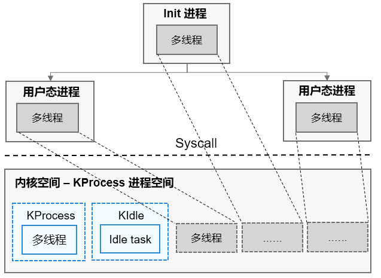

# 进程

-   [基本概念](#section89346055119)
-   [运行机制](#section174514474512)
-   [开发指导](#section159637182521)
    -   [接口说明](#section1153124135212)
    -   [开发流程](#section1533674618526)

## 基本概念

进程是系统资源管理的最小单元。OpenHarmony LiteOS-A内核提供的进程模块主要用于实现用户态进程的隔离，内核态被视为一个进程空间，不存在其它进程\(KIdle除外，KIdle进程是系统提供的空闲进程，和KProcess共享一个进程空间）。

-   OpenHarmony 的进程模块主要为用户提供多个进程，实现了进程之间的切换和通信，帮助用户管理业务程序流程。
-   OpenHarmony 的进程采用抢占式调度机制，采用高优先级优先+同优先级时间片轮转的调度算法。
-   OpenHarmony 的进程一共有32个优先级\(0-31\)，用户进程可配置的优先级有22个\(10-31\)，最高优先级为10，最低优先级为31。
-   高优先级的进程可抢占低优先级进程，低优先级进程必须在高优先级进程阻塞或结束后才能得到调度。
-   每一个用户态进程均拥有自己独立的进程空间，相互之间不可见，实现进程间隔离。
-   用户态根进程init由内核态创建，其它用户态子进程均由init进程fork而来。

**进程状态说明：**

-   初始化（Init）：进程正在被创建。

-   就绪（Ready）：进程在就绪列表中，等待CPU调度。
-   运行（Running）：进程正在运行。
-   阻塞（Pending）：进程被阻塞挂起。本进程内所有的线程均被阻塞时，进程被阻塞挂起。
-   僵尸（Zombies）：进程运行结束，等待父进程回收其控制块资源。

**图 1**  进程状态迁移示意图  

**进程状态迁移说明：**

-   Init→Ready：

    进程创建或fork时，拿到该进程控制块后进入Init状态，处于进程初始化阶段，当进程初始化完成将进程插入调度队列，此时进程进入就绪状态。

-   Ready→Running：

    进程创建后进入就绪态，发生进程切换时，就绪列表中最高优先级的进程被执行，从而进入运行态。若此时该进程中已无其它线程处于就绪态，则进程从就绪列表删除，只处于运行态；若此时该进程中还有其它线程处于就绪态，则该进程依旧在就绪队列，此时进程的就绪态和运行态共存，但对外呈现的进程状态为运行态。

-   Running→Pending：

    进程在最后一个线程转为阻塞态时， 进程内所有的线程均处于阻塞态，此时进程同步进入阻塞态，然后发生进程切换。

-   Pending→Ready：

    阻塞进程内的任意线程恢复就绪态时，进程被加入到就绪队列，同步转为就绪态。

-   Ready→Pending：

    进程内的最后一个就绪态线程转为阻塞态时，进程从就绪列表中删除，进程由就绪态转为阻塞态。

-   Running→Ready：

    进程由运行态转为就绪态的情况有以下两种：

    1.  有更高优先级的进程创建或者恢复后，会发生进程调度，此刻就绪列表中最高优先级进程变为运行态，那么原先运行的进程由运行态变为就绪态。
    2.  若进程的调度策略为LOS\_SCHED\_RR，且存在同一优先级的另一个进程处于就绪态，则该进程的时间片消耗光之后，该进程由运行态转为就绪态，另一个同优先级的进程由就绪态转为运行态。

-   Running→Zombies：

    当进程的主线程或所有线程运行结束后，进程由运行态转为僵尸态，等待父进程回收资源。

## 运行机制

OpenHarmony 提供的进程模块主要用于实现用户态进程的隔离，支持用户态进程的创建、退出、资源回收、设置/获取调度参数、获取进程ID、设置/获取进程组ID等功能。

用户态进程通过fork父进程而来，fork进程时会将父进程的进程虚拟内存空间clone到子进程，子进程实际运行时通过写时复制机制将父进程的内容按需复制到子进程的虚拟内存空间。

进程只是资源管理单元，实际运行是由进程内的各个线程完成的，不同进程内的线程相互切换时会进行进程空间的切换。

**图 2**  进程管理示意图  

## 开发指导

### 接口说明

**表 1**  进程管理模块接口

<table><thead align="left"><tr id="row85991712770"><th class="cellrowborder" valign="top" width="33.33333333333333%" id="mcps1.2.4.1.1">
功能分类

</th>
<th class="cellrowborder" valign="top" width="33.33333333333333%" id="mcps1.2.4.1.2">
接口<strong id="b197068338312">名称</strong>

</th>
<th class="cellrowborder" valign="top" width="33.33333333333333%" id="mcps1.2.4.1.3">
描述

</th>
</tr>
</thead>
<tbody><tr id="row66002121074"><td class="cellrowborder" rowspan="4" valign="top" width="33.33333333333333%" headers="mcps1.2.4.1.1 ">
进程调度参数控制

</td>
<td class="cellrowborder" valign="top" width="33.33333333333333%" headers="mcps1.2.4.1.2 ">
LOS_GetProcessScheduler

</td>
<td class="cellrowborder" valign="top" width="33.33333333333333%" headers="mcps1.2.4.1.3 ">
获取指定进程的调度策略

</td>
</tr>
<tr id="row166001712574"><td class="cellrowborder" valign="top" headers="mcps1.2.4.1.1 ">
LOS_SetProcessScheduler

</td>
<td class="cellrowborder" valign="top" headers="mcps1.2.4.1.2 ">
设置指定进程的调度参数，包括优先级和调度策略

</td>
</tr>
<tr id="row1560071212719"><td class="cellrowborder" valign="top" headers="mcps1.2.4.1.1 ">
LOS_GetProcessPriority

</td>
<td class="cellrowborder" valign="top" headers="mcps1.2.4.1.2 ">
获取指定进程的优先级

</td>
</tr>
<tr id="row1274011131587"><td class="cellrowborder" valign="top" headers="mcps1.2.4.1.1 ">
LOS_SetProcessPriority

</td>
<td class="cellrowborder" valign="top" headers="mcps1.2.4.1.2 ">
设置指定进程的优先级

</td>
</tr>
<tr id="row162882182816"><td class="cellrowborder" valign="top" width="33.33333333333333%" headers="mcps1.2.4.1.1 ">
等待回收子进程

</td>
<td class="cellrowborder" valign="top" width="33.33333333333333%" headers="mcps1.2.4.1.2 ">
LOS_Wait

</td>
<td class="cellrowborder" valign="top" width="33.33333333333333%" headers="mcps1.2.4.1.3 ">
等待子进程结束并回收子进程

</td>
</tr>
<tr id="row81051920589"><td class="cellrowborder" rowspan="2" valign="top" width="33.33333333333333%" headers="mcps1.2.4.1.1 ">
进程组

</td>
<td class="cellrowborder" valign="top" width="33.33333333333333%" headers="mcps1.2.4.1.2 ">
LOS_GetProcessGroupID

</td>
<td class="cellrowborder" valign="top" width="33.33333333333333%" headers="mcps1.2.4.1.3 ">
获取指定进程的进程组ID

</td>
</tr>
<tr id="row13410161611819"><td class="cellrowborder" valign="top" headers="mcps1.2.4.1.1 ">
LOS_GetCurrProcessGroupID

</td>
<td class="cellrowborder" valign="top" headers="mcps1.2.4.1.2 ">
获取当前进程的进程组ID

</td>
</tr>
<tr id="row1260011213718"><td class="cellrowborder" valign="top" width="33.33333333333333%" headers="mcps1.2.4.1.1 ">
获取进程ID

</td>
<td class="cellrowborder" valign="top" width="33.33333333333333%" headers="mcps1.2.4.1.2 ">
LOS_GetCurrProcessID

</td>
<td class="cellrowborder" valign="top" width="33.33333333333333%" headers="mcps1.2.4.1.3 ">
获取当前进程的进程ID

</td>
</tr>
<tr id="row060019121871"><td class="cellrowborder" rowspan="3" valign="top" width="33.33333333333333%" headers="mcps1.2.4.1.1 ">
用户及用户组

</td>
<td class="cellrowborder" valign="top" width="33.33333333333333%" headers="mcps1.2.4.1.2 ">
LOS_GetUserID

</td>
<td class="cellrowborder" valign="top" width="33.33333333333333%" headers="mcps1.2.4.1.3 ">
获取当前进程的用户ID

</td>
</tr>
<tr id="row1160021211713"><td class="cellrowborder" valign="top" headers="mcps1.2.4.1.1 ">
LOS_GetGroupID

</td>
<td class="cellrowborder" valign="top" headers="mcps1.2.4.1.2 ">
获取当前进程的用户组ID

</td>
</tr>
<tr id="row1160018123717"><td class="cellrowborder" valign="top" headers="mcps1.2.4.1.1 ">
LOS_CheckInGroups

</td>
<td class="cellrowborder" valign="top" headers="mcps1.2.4.1.2 ">
检查指定用户组ID是否在当前进程的用户组内

</td>
</tr>
<tr id="row317461111812"><td class="cellrowborder" valign="top" width="33.33333333333333%" headers="mcps1.2.4.1.1 ">
系统支持的最大进程数

</td>
<td class="cellrowborder" valign="top" width="33.33333333333333%" headers="mcps1.2.4.1.2 ">
LOS_GetSystemProcessMaximum

</td>
<td class="cellrowborder" valign="top" width="33.33333333333333%" headers="mcps1.2.4.1.3 ">
获取系统支持的最大进程数目

</td>
</tr>
</tbody>
</table>

### 开发流程

不支持内核态进程创建，内核态不涉及进程相关开发。

> **说明：** 
>-   idle线程的数量跟随CPU核心数，每个CPU均有一个相应的idle线程。
>-   不支持创建除KProcess和KIdle进程之外的其它内核态进程。
>-   用户态进程通过系统调用进入内核态后创建的线程属于KProcess, 不属于当前用户态进程。

