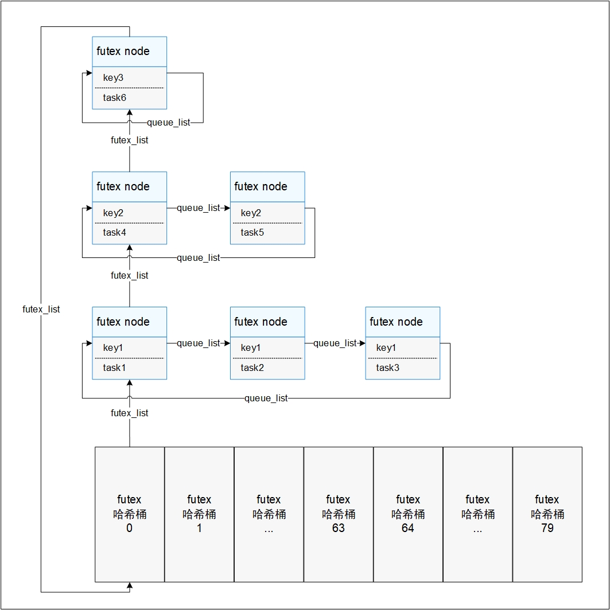

# 用户态快速互斥锁

-   [基本概念](#section643519912920)
-   [运行机制](#section16834132502910)

## 基本概念

Futex\(Fast userspace mutex，用户态快速互斥锁\)是内核提供的一种系统调用能力，通常作为基础组件与用户态的相关锁逻辑结合组成用户态锁，是一种用户态与内核态共同作用的锁，例如用户态mutex锁、barrier与cond同步锁、读写锁。其用户态部分负责锁逻辑，内核态部分负责锁调度。

当用户态线程请求锁时，先在用户态进行锁状态的判断维护，若此时不产生锁的竞争，则直接在用户态进行上锁返回；反之，则需要进行线程的挂起操作，通过Futex系统调用请求内核介入来挂起线程，并维护阻塞队列。

当用户态线程释放锁时，先在用户态进行锁状态的判断维护，若此时没有其他线程被该锁阻塞，则直接在用户态进行解锁返回；反之，则需要进行阻塞线程的唤醒操作，通过Futex系统调用请求内核介入来唤醒阻塞队列中的线程。

## 运行机制

当用户态产生锁的竞争或释放需要进行相关线程的调度操作时，会触发Futex系统调用进入内核，此时会将用户态锁的地址传入内核，并在内核的Futex中以锁地址来区分用户态的每一把锁，因为用户态可用虚拟地址空间为1GiB，为了便于查找、管理，内核Futex采用哈希桶来存放用户态传入的锁。

当前哈希桶共有80个，0\~63号桶用于存放私有锁（以虚拟地址进行哈希），64\~79号桶用于存放共享锁（以物理地址进行哈希），私有/共享属性通过用户态锁的初始化以及Futex系统调用入参确定。

**图 1**  Futex设计图  

如图1，每个futex哈希桶中存放被futex\_list串联起来的哈希值相同的futex node，每个futex node对应一个被挂起的task，node中key值唯一标识一把用户态锁，具有相同key值的node被queue\_list串联起来表示被同一把锁阻塞的task队列。

Futex有以下三种操作：

**表 1**  Futex模块接口

<table><thead align="left"><tr id="row191622182021"><th class="cellrowborder" valign="top" width="27.09270927092709%" id="mcps1.2.4.1.1">
功能分类

</th>
<th class="cellrowborder" valign="top" width="26.52265226522652%" id="mcps1.2.4.1.2">
接口<strong id="b197068338312">名称</strong>

</th>
<th class="cellrowborder" valign="top" width="46.384638463846386%" id="mcps1.2.4.1.3">
描述

</th>
</tr>
</thead>
<tbody><tr id="row04981218910"><td class="cellrowborder" valign="top" width="27.09270927092709%" headers="mcps1.2.4.1.1 ">
设置线程等待

</td>
<td class="cellrowborder" valign="top" width="26.52265226522652%" headers="mcps1.2.4.1.2 ">
OsFutexWait

</td>
<td class="cellrowborder" valign="top" width="46.384638463846386%" headers="mcps1.2.4.1.3 ">
向Futex表中插入代表被阻塞的线程的node

</td>
</tr>
<tr id="row7162101814216"><td class="cellrowborder" valign="top" width="27.09270927092709%" headers="mcps1.2.4.1.1 ">
唤醒被阻塞线程

</td>
<td class="cellrowborder" valign="top" width="26.52265226522652%" headers="mcps1.2.4.1.2 ">
OsFutexWake

</td>
<td class="cellrowborder" valign="top" width="46.384638463846386%" headers="mcps1.2.4.1.3 ">
唤醒一个被指定锁阻塞的线程

</td>
</tr>
<tr id="row101631818620"><td class="cellrowborder" valign="top" width="27.09270927092709%" headers="mcps1.2.4.1.1 ">
调整锁的地址

</td>
<td class="cellrowborder" valign="top" width="26.52265226522652%" headers="mcps1.2.4.1.2 ">
OsFutexRequeue

</td>
<td class="cellrowborder" valign="top" width="46.384638463846386%" headers="mcps1.2.4.1.3 ">
调整指定锁在Futex表中的位置

</td>
</tr>
</tbody>
</table>

> **说明：** 
>Futex系统调用通常与用户态逻辑共同组成用户态锁，故推荐使用用户态POSIX接口的锁。

