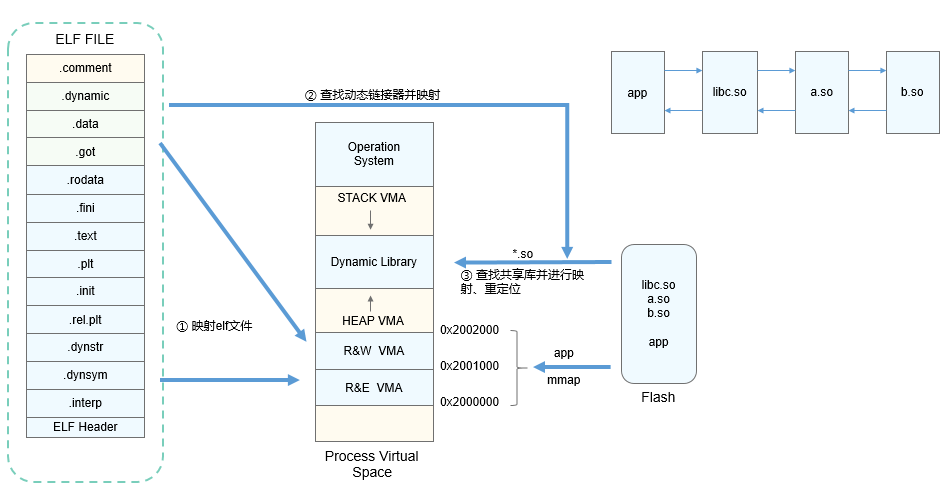

# 动态加载与链接

-   [基本概念](#section208951139453)
-   [运行机制](#section14140155320511)
-   [开发指导](#section133501496612)
    -   [接口说明](#section874113201669)
    -   [开发流程](#section196712561563)

## 基本概念

OpenHarmony系统的动态加载与链接机制主要是由内核加载器以及动态链接器构成，内核加载器用于加载应用程序以及动态链接器，动态链接器用于加载应用程序所依赖的共享库，并对应用程序和共享库进行符号重定位。与静态链接相比，动态链接是将应用程序与动态库推迟到运行时再进行链接的一种机制。

**动态链接的优势：**

1.  多个应用程序可以共享一份代码，最小加载单元为页，相对静态链接可以节约磁盘和内存空间。
2.  共享库升级时，理论上将旧版本的共享库覆盖即可（共享库中的接口向下兼容），无需重新链接。
3.  加载地址可以进行随机化处理，防止攻击，保证安全性。

## 运行机制

**图 1**  动态加载流程  

1.  内核将应用程序ELF文件的PT\_LOAD段信息映射至进程空间。对于ET\_EXEC类型的文件，根据PT\_LOAD段中p\_vaddr进行固定地址映射；对于ET\_DYN类型（位置无关的可执行程序，通过编译选项“-fPIE”得到）的文件，内核通过mmap接口选择base基址进行映射（load\_addr = base + p\_vaddr）。
2.  若应用程序是静态链接的（静态链接不支持编译选项“-fPIE”），设置堆栈信息后跳转至应用程序ELF文件中e\_entry指定的地址并运行；若程序是动态链接的，应用程序ELF文件中会有PT\_INTERP段，保存动态链接器的路径信息（ET\_DYN类型）。musl的动态链接器是libc-musl.so的一部分，libc-musl.so的入口即动态链接器的入口。内核通过mmap接口选择base基址进行映射，设置堆栈信息后跳转至base + e\_entry（该e\_entry为动态链接器的入口）地址并运行动态链接器。
3.  动态链接器自举并查找应用程序依赖的所有共享库并对导入符号进行重定位，最后跳转至应用程序的e\_entry（或base + e\_entry），开始运行应用程序。

**图 2**  程序执行流程  

1.  加载器与链接器调用mmap映射PT\_LOAD段；
2.  内核调用map\_pages接口查找并映射pagecache已有的缓存；
3.  程序执行时，内存若无所需代码或数据时触发缺页中断，将elf文件内容读入内存，并将该内存块加入pagecache；
4.  将已读入文件内容的内存块与虚拟地址区间做映射；
5.  程序继续执行；

至此，程序将在不断地缺页中断中执行。

## 开发指导

### 接口说明

LOS\_DoExecveFile

**函数原型：**

INT32 LOS\_DoExecveFile\(const CHAR \*fileName, CHAR \* const \*argv, CHAR \* const \*envp\);

**函数功能：**根据fileName执行一个新的用户程序。

**参数说明：**

<table><thead align="left"><tr id="row1170923910316"><th class="cellrowborder" valign="top" width="11.92%" id="mcps1.1.3.1.1">
参数

</th>
<th class="cellrowborder" valign="top" width="88.08%" id="mcps1.1.3.1.2">
描述

</th>
</tr>
</thead>
<tbody><tr id="row7709113923117"><td class="cellrowborder" valign="top" width="11.92%" headers="mcps1.1.3.1.1 ">
fileName

</td>
<td class="cellrowborder" valign="top" width="88.08%" headers="mcps1.1.3.1.2 ">
二进制可执行文件名，可以是路径名。

</td>
</tr>
<tr id="row0709163973120"><td class="cellrowborder" valign="top" width="11.92%" headers="mcps1.1.3.1.1 ">
argv

</td>
<td class="cellrowborder" valign="top" width="88.08%" headers="mcps1.1.3.1.2 ">
程序执行所需的参数序列，以NULL结尾。无需参数时填入NULL。

</td>
</tr>
<tr id="row341018142206"><td class="cellrowborder" valign="top" width="11.92%" headers="mcps1.1.3.1.1 ">
envp

</td>
<td class="cellrowborder" valign="top" width="88.08%" headers="mcps1.1.3.1.2 ">
程序执行所需的新的环境变量序列，以NULL结尾。无需新的环境变量时填入NULL。

</td>
</tr>
</tbody>
</table>

### 开发流程

LOS\_DoExecveFile接口一般由用户通过execve系列接口利用系统调用机制调用创建新的进程，内核不能直接调用该接口启动新进程。

