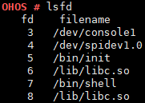

# lsfd

-   [命令功能](#section2053406181716)
-   [命令格式](#section523771017172)
-   [使用指南](#section27241213201719)
-   [使用实例](#section442617197173)
-   [输出说明](#section42491639151813)

## 命令功能

lsfd命令用来显示当前已经打开的文件描述符及对应的文件名。

## 命令格式

lsfd

## 使用指南

lsfd命令显示当前已经打开文件的fd号以及文件的名字。

## 使用实例

举例：输入lsfd

## 输出说明

**图 1**  lsfd输出说明  

