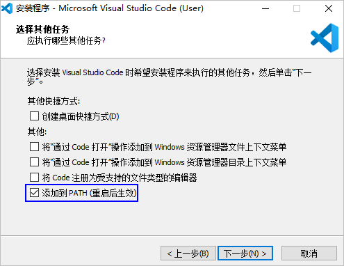
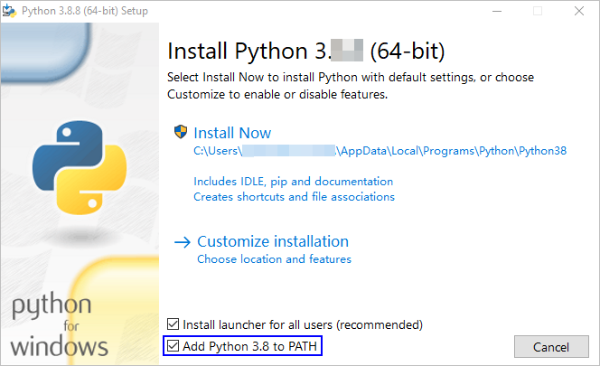
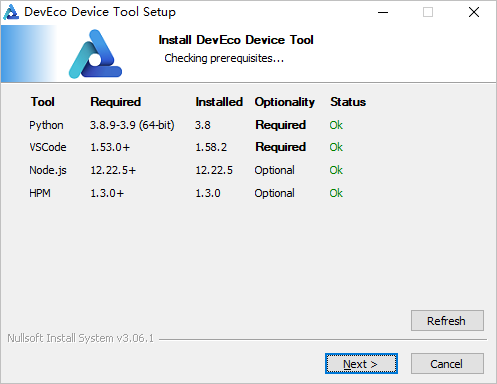
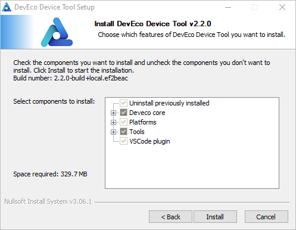
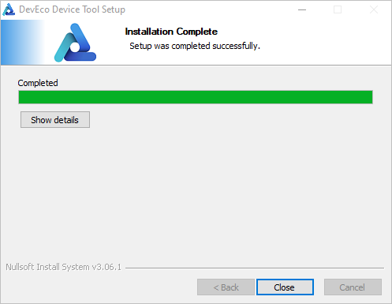

# 搭建Windows开发环境<a name="ZH-CN_TOPIC_0000001124187462"></a>

-   [获取软件](#zh-cn_topic_0000001058091994_section1483143015558)
-   [安装Visual Studio Code](#zh-cn_topic_0000001058091994_section71401018163318)
-   [安装Python](#zh-cn_topic_0000001058091994_section16266553175320)
-   [安装Node.js](#zh-cn_topic_0000001058091994_section5353233124511)
-   [安装hpm](#zh-cn_topic_0000001058091994_section173054793610)
-   [安装DevEco Device Tool插件](#zh-cn_topic_0000001058091994_section4336315185716)

系统要求：

-   Windows 10 64位系统。
-   系统的用户名不能含有中文字符。

DevEco Device Tool以插件方式提供，基于Visual Studio Code进行扩展，安装分为如下几步：

1.  安装Visual Studio Code
2.  安装Python
3.  安装Node.js
4.  安装hpm
5.  安装DevEco Device Tool插件

## 获取软件<a name="zh-cn_topic_0000001058091994_section1483143015558"></a>

<a name="zh-cn_topic_0000001058091994_table12730195765616"></a>
<table><thead align="left"><tr id="zh-cn_topic_0000001058091994_row6730125785610"><th class="cellrowborder" valign="top" width="19.49%" id="mcps1.1.5.1.1"><p id="zh-cn_topic_0000001058091994_p1573065716561"><a name="zh-cn_topic_0000001058091994_p1573065716561"></a><a name="zh-cn_topic_0000001058091994_p1573065716561"></a>工具名称</p>
</th>
<th class="cellrowborder" valign="top" width="20.5%" id="mcps1.1.5.1.2"><p id="zh-cn_topic_0000001058091994_p197306572566"><a name="zh-cn_topic_0000001058091994_p197306572566"></a><a name="zh-cn_topic_0000001058091994_p197306572566"></a>用途说明</p>
</th>
<th class="cellrowborder" valign="top" width="20.03%" id="mcps1.1.5.1.3"><p id="zh-cn_topic_0000001058091994_p373085711569"><a name="zh-cn_topic_0000001058091994_p373085711569"></a><a name="zh-cn_topic_0000001058091994_p373085711569"></a>版本要求</p>
</th>
<th class="cellrowborder" valign="top" width="39.98%" id="mcps1.1.5.1.4"><p id="zh-cn_topic_0000001058091994_p197309576566"><a name="zh-cn_topic_0000001058091994_p197309576566"></a><a name="zh-cn_topic_0000001058091994_p197309576566"></a>获取渠道</p>
</th>
</tr>
</thead>
<tbody><tr id="zh-cn_topic_0000001058091994_row12730155765618"><td class="cellrowborder" valign="top" width="19.49%" headers="mcps1.1.5.1.1 "><p id="zh-cn_topic_0000001058091994_p123931728135713"><a name="zh-cn_topic_0000001058091994_p123931728135713"></a><a name="zh-cn_topic_0000001058091994_p123931728135713"></a>Visual Studio Code</p>
</td>
<td class="cellrowborder" valign="top" width="20.5%" headers="mcps1.1.5.1.2 "><p id="zh-cn_topic_0000001058091994_p12332194816317"><a name="zh-cn_topic_0000001058091994_p12332194816317"></a><a name="zh-cn_topic_0000001058091994_p12332194816317"></a>代码编辑工具</p>
</td>
<td class="cellrowborder" valign="top" width="20.03%" headers="mcps1.1.5.1.3 "><p id="zh-cn_topic_0000001058091994_p711918919618"><a name="zh-cn_topic_0000001058091994_p711918919618"></a><a name="zh-cn_topic_0000001058091994_p711918919618"></a>V1.53及以上64位版本。</p>
</td>
<td class="cellrowborder" valign="top" width="39.98%" headers="mcps1.1.5.1.4 "><p id="zh-cn_topic_0000001058091994_p2721438193710"><a name="zh-cn_topic_0000001058091994_p2721438193710"></a><a name="zh-cn_topic_0000001058091994_p2721438193710"></a><a href="https://code.visualstudio.com/Download" target="_blank" rel="noopener noreferrer">https://code.visualstudio.com/Download</a></p>
</td>
</tr>
<tr id="zh-cn_topic_0000001058091994_row187311257185619"><td class="cellrowborder" valign="top" width="19.49%" headers="mcps1.1.5.1.1 "><p id="zh-cn_topic_0000001058091994_p21270444579"><a name="zh-cn_topic_0000001058091994_p21270444579"></a><a name="zh-cn_topic_0000001058091994_p21270444579"></a>Python</p>
</td>
<td class="cellrowborder" valign="top" width="20.5%" headers="mcps1.1.5.1.2 "><p id="zh-cn_topic_0000001058091994_p547205817316"><a name="zh-cn_topic_0000001058091994_p547205817316"></a><a name="zh-cn_topic_0000001058091994_p547205817316"></a>编译构建工具</p>
</td>
<td class="cellrowborder" valign="top" width="20.03%" headers="mcps1.1.5.1.3 "><p id="zh-cn_topic_0000001058091994_p1991315166416"><a name="zh-cn_topic_0000001058091994_p1991315166416"></a><a name="zh-cn_topic_0000001058091994_p1991315166416"></a>V3.8.9及以上64位版本</p>
</td>
<td class="cellrowborder" valign="top" width="39.98%" headers="mcps1.1.5.1.4 "><p id="zh-cn_topic_0000001058091994_p108321457411"><a name="zh-cn_topic_0000001058091994_p108321457411"></a><a name="zh-cn_topic_0000001058091994_p108321457411"></a><a href="https://www.python.org/downloads/" target="_blank" rel="noopener noreferrer">https://www.python.org/downloads/</a></p>
</td>
</tr>
<tr id="zh-cn_topic_0000001058091994_row117316576562"><td class="cellrowborder" valign="top" width="19.49%" headers="mcps1.1.5.1.1 "><p id="zh-cn_topic_0000001058091994_p16405151165717"><a name="zh-cn_topic_0000001058091994_p16405151165717"></a><a name="zh-cn_topic_0000001058091994_p16405151165717"></a>Node.js</p>
</td>
<td class="cellrowborder" valign="top" width="20.5%" headers="mcps1.1.5.1.2 "><p id="zh-cn_topic_0000001058091994_p1773185765616"><a name="zh-cn_topic_0000001058091994_p1773185765616"></a><a name="zh-cn_topic_0000001058091994_p1773185765616"></a>提供npm环境</p>
</td>
<td class="cellrowborder" valign="top" width="20.03%" headers="mcps1.1.5.1.3 "><p id="zh-cn_topic_0000001058091994_p16304104120181"><a name="zh-cn_topic_0000001058091994_p16304104120181"></a><a name="zh-cn_topic_0000001058091994_p16304104120181"></a>以下版本三选一：</p>
<a name="zh-cn_topic_0000001058091994_ul875854471719"></a><a name="zh-cn_topic_0000001058091994_ul875854471719"></a><ul id="zh-cn_topic_0000001058091994_ul875854471719"><li>V12.22.5及以上64位版本</li><li>V14.17.5及以上64版本</li><li>V16.6.0及以上64位版本</li></ul>
</td>
<td class="cellrowborder" valign="top" width="39.98%" headers="mcps1.1.5.1.4 "><p id="zh-cn_topic_0000001058091994_p9200911141112"><a name="zh-cn_topic_0000001058091994_p9200911141112"></a><a name="zh-cn_topic_0000001058091994_p9200911141112"></a><a href="https://nodejs.org/zh-cn/download/" target="_blank" rel="noopener noreferrer">https://nodejs.org/zh-cn/download/</a></p>
</td>
</tr>
<tr id="zh-cn_topic_0000001058091994_row6731105715561"><td class="cellrowborder" valign="top" width="19.49%" headers="mcps1.1.5.1.1 "><p id="zh-cn_topic_0000001058091994_p2081865318571"><a name="zh-cn_topic_0000001058091994_p2081865318571"></a><a name="zh-cn_topic_0000001058091994_p2081865318571"></a>hpm</p>
</td>
<td class="cellrowborder" valign="top" width="20.5%" headers="mcps1.1.5.1.2 "><p id="zh-cn_topic_0000001058091994_p1632215161040"><a name="zh-cn_topic_0000001058091994_p1632215161040"></a><a name="zh-cn_topic_0000001058091994_p1632215161040"></a>包管理工具</p>
</td>
<td class="cellrowborder" valign="top" width="20.03%" headers="mcps1.1.5.1.3 "><p id="zh-cn_topic_0000001058091994_p773185715566"><a name="zh-cn_topic_0000001058091994_p773185715566"></a><a name="zh-cn_topic_0000001058091994_p773185715566"></a>V1.3.0及以上</p>
</td>
<td class="cellrowborder" valign="top" width="39.98%" headers="mcps1.1.5.1.4 "><p id="zh-cn_topic_0000001058091994_p14731125745610"><a name="zh-cn_topic_0000001058091994_p14731125745610"></a><a name="zh-cn_topic_0000001058091994_p14731125745610"></a>请参考<a href="#zh-cn_topic_0000001058091994_section173054793610">安装hpm</a>。</p>
</td>
</tr>
<tr id="zh-cn_topic_0000001058091994_row13317205645717"><td class="cellrowborder" valign="top" width="19.49%" headers="mcps1.1.5.1.1 "><p id="zh-cn_topic_0000001058091994_p143411112587"><a name="zh-cn_topic_0000001058091994_p143411112587"></a><a name="zh-cn_topic_0000001058091994_p143411112587"></a>DevEco Device Tool</p>
</td>
<td class="cellrowborder" valign="top" width="20.5%" headers="mcps1.1.5.1.2 "><p id="zh-cn_topic_0000001058091994_p1690316506517"><a name="zh-cn_topic_0000001058091994_p1690316506517"></a><a name="zh-cn_topic_0000001058091994_p1690316506517"></a>OpenHarmony源码的编译、烧录、调试插件工具</p>
</td>
<td class="cellrowborder" valign="top" width="20.03%" headers="mcps1.1.5.1.3 "><p id="zh-cn_topic_0000001058091994_p113171956185715"><a name="zh-cn_topic_0000001058091994_p113171956185715"></a><a name="zh-cn_topic_0000001058091994_p113171956185715"></a>V2.2 Beta2</p>
</td>
<td class="cellrowborder" valign="top" width="39.98%" headers="mcps1.1.5.1.4 "><p id="zh-cn_topic_0000001058091994_p3503163074720"><a name="zh-cn_topic_0000001058091994_p3503163074720"></a><a name="zh-cn_topic_0000001058091994_p3503163074720"></a><a href="https://device.harmonyos.com/cn/ide#download_beta" target="_blank" rel="noopener noreferrer">https://device.harmonyos.com/cn/ide#download_beta</a></p>
<p id="zh-cn_topic_0000001058091994_p23171856135717"><a name="zh-cn_topic_0000001058091994_p23171856135717"></a><a name="zh-cn_topic_0000001058091994_p23171856135717"></a>下载前，请使用华为开发者帐号登录，如未注册，请先<a href="https://developer.huawei.com/consumer/cn/doc/start/registration-and-verification-0000001053628148" target="_blank" rel="noopener noreferrer">注册华为开发者帐号</a>。</p>
</td>
</tr>
</tbody>
</table>

## 安装Visual Studio Code<a name="zh-cn_topic_0000001058091994_section71401018163318"></a>

> **说明：** 
>如果已安装Visual Studio Code，打开命令行工具，输入**code --version**命令，检查版本号是否为1.53及以上版本；可以正常返回版本号，说明环境变量设置也正确。

1.  双击Visual Studio Code软件包进行安装。安装过程中，请勾选“添加到PATH（重启后生效）”。

    

2.  安装完成后，打开命令行工具，输入**code --version**命令，可以正常显示版本号说明安装成功。

## 安装Python<a name="zh-cn_topic_0000001058091994_section16266553175320"></a>

1.  双击Python安装包进行安装，勾选“**Add Python 3.8 to PATH**”，然后点击**Install Now**开始安装。

    

2.  等待安装完成后，点击**Close**。

    

3.  打开命令行工具，输入python --version，检查安装结果。

    

4.  在命令行工具中，分别执行如下命令设置pip源，用于后续安装DevEco Device Tool过程中下载依赖的组件包。

    ```
    pip config set global.trusted-host repo.huaweicloud.com
    pip config set global.index-url https://repo.huaweicloud.com/repository/pypi/simple
    pip config set global.timeout 120
    ```


## 安装Node.js<a name="zh-cn_topic_0000001058091994_section5353233124511"></a>

> **说明：** 
>如果已安装Node.js，打开命令行工具，输入**node -v**命令，检查版本号是否为12.0.0及以上版本。

1.  点击下载后的软件包进行安装，全部按照默认设置点击**Next**，直至**Finish**。安装过程中，Node.js会自动在系统的path环境变量中配置node.exe的目录路径。
2.  重新打开命令行工具，输入“node -v“命令，能正常查询Node.js的版本号，说明Node.js安装成功。

## 安装hpm<a name="zh-cn_topic_0000001058091994_section173054793610"></a>

该方式需先确保**Node.js**安装成功。

在安装hpm前，请检查网络连接状态，如果网络不能直接访问Internet，则需要通过代理服务器才可以访问。这种情况下，需要先[设置npm代理](https://device.harmonyos.com/cn/docs/ide/user-guides/npm_proxy-0000001054491032)，才能安装hpm。

> **说明：** 
>如果已安装hpm，可以执行**npm update -g @ohos/hpm-cli**命令升级hpm至最新版本。

1.  建议将npm源配置为国内镜像，例如设置为华为云镜像源。

    ```
    npm config set registry https://repo.huaweicloud.com/repository/npm/
    ```

2.  打开命令行工具，执行如下命令安装最新版本hpm。

    ```
    npm install -g @ohos/hpm-cli
    ```

    

3.  安装完成后，执行如下命令（V为大写字母）检查hpm安装结果。

    ```
    hpm -V
    ```


## 安装DevEco Device Tool插件<a name="zh-cn_topic_0000001058091994_section4336315185716"></a>

安装DevEco Device Tool插件，**主机的用户名不能包含中文字符**，否则在运行DevEco Device Tool时，DevEco Home界面会一直处于Loading状态，导致不能正常使用。

DevEco Device Tool正常运行需要依赖于C/C++和CodeLLDB插件，在安装完DevEco Device Tool后，会自动从Visual Studio Code的插件市场安装C/C++和CodeLLDB插件。因此，在安装DevEco Device Tool前，请检查Visual Studio Code的网络连接状态，如果网络不能直接访问Internet，则需要通过代理服务器才可以访问，请先[Visual Studio Code代理设置](https://device.harmonyos.com/cn/docs/ide/user-guides/vscode_proxy-0000001074231144)。

> **说明：** 
>安装DevEco Device Tool时，请先关闭Visual Studio Code。

1.  解压DevEco Device Tool插件压缩包，双击安装包程序进行安装。
2.  DevEco Device Tool会检测安装依赖的工具包是否符合要求。如果不符合要求，请按照本章节前面的内容进行安装。

    > **说明：** 
    >如果已经安装Visual Studio Code，但依然检测不到，可重启电脑解决。

    

3.  点击**Install**进行安装。

    

4.  等待安装完成后，点击Close关闭安装界面。

    

5.  启动Visual Studio Code，会自动安装DevEco Device Tool依赖的C/C++、CodeLLDB插件。等待安装完成后，点击Visual Studio Code左侧的按钮，检查INSTALLED中，是否已成功安装C/C++、CodeLLDB和DevEco Device Tool。

    > **说明：** 
    >如果C/C++和CodeLLDB插件安装不成功，则DevEco Device Tool不能正常运行，解决方法，详细请参考：[离线安装C/C++和CodeLLDB插件](https://device.harmonyos.com/cn/docs/ide/user-guides/offline_plugin_install-0000001074376846)。

    


