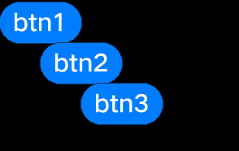

# 容器类组件开发指导<a name="ZH-CN_TOPIC_0000001052810390"></a>

-   [UIViewGroup](#section145471898812)
-   [使用场景](#section0916112362216)
-   [接口说明](#section12641756192212)
-   [开发步骤](#section5412161692311)
-   [UIScrollView](#section174961523161315)
-   [使用场景](#section8937101902413)
-   [接口说明](#section14789133142420)
-   [开发步骤](#section1769754422417)

容器类组件，指能包含其它UI组件的组件，容器类组件继承于UIViewGroup（带Add方法），基于实际组件的使用场景，将需要增加其他子组件的组件，放置到容器类继承结构下。如UIAnalogClock内，通常会Add需要的计步信息，时分秒图标等。

**图 1**  普通容器类组件结构<a name="fig1931013319293"></a>  


RootView、UIAbstractScroll、UIPicker组件从UIViewGroup继承，UIList、UIScrollView、UISwipeView组件从UIAbstractScroll继承。

## UIViewGroup<a name="section145471898812"></a>

## 使用场景<a name="section0916112362216"></a>

UIViewGroup是容器类组件基类，实现增加、删除、插入等操作，通过增加方法可以添加子组件。普通容器类组件子组件需要设置位置信息，位置信息为相对父组件的相对坐标。组件树结构如下图：

**图 2**  组件树结构示意图<a name="fig279970183012"></a>  


往根节点rootView里添加ViewGroup1容器组件和View1组件，往ViewGroup1容器组件里再添加View2组件和ViewGroup2容器组件，在View1之后添加View3组件。

-   关于渲染：容器类组件在渲染时会遍历所有子组件OnDraw方法，以达到刷新所有组件的目的。
-   关于坐标：子组件位置信息为相对父组件的相对坐标，系统在渲染时计算绝对坐标并显示。
-   关于树结构遍历：UIViewGroup提供如下方法实现遍历、查找、管理组件树。

## 接口说明<a name="section12641756192212"></a>

**表 1**  ViewGroup接口说明

<a name="table15959122392211"></a>
<table><thead align="left"><tr id="row14957132342220"><th class="cellrowborder" valign="top" width="64.73%" id="mcps1.2.3.1.1"><p id="p3957182302217"><a name="p3957182302217"></a><a name="p3957182302217"></a>方法</p>
</th>
<th class="cellrowborder" valign="top" width="35.27%" id="mcps1.2.3.1.2"><p id="p1595742312219"><a name="p1595742312219"></a><a name="p1595742312219"></a>功能</p>
</th>
</tr>
</thead>
<tbody><tr id="row14957123162218"><td class="cellrowborder" valign="top" width="64.73%" headers="mcps1.2.3.1.1 "><p id="p89572023102216"><a name="p89572023102216"></a><a name="p89572023102216"></a>virtual void Add(UIView* view)</p>
</td>
<td class="cellrowborder" valign="top" width="35.27%" headers="mcps1.2.3.1.2 "><p id="p1495720236223"><a name="p1495720236223"></a><a name="p1495720236223"></a>添加子组件</p>
</td>
</tr>
<tr id="row895892310224"><td class="cellrowborder" valign="top" width="64.73%" headers="mcps1.2.3.1.1 "><p id="p16958192315227"><a name="p16958192315227"></a><a name="p16958192315227"></a>virtual void Insert(UIView* prevView, UIView* insertView)</p>
</td>
<td class="cellrowborder" valign="top" width="35.27%" headers="mcps1.2.3.1.2 "><p id="p1958223152210"><a name="p1958223152210"></a><a name="p1958223152210"></a>插入子组件</p>
</td>
</tr>
<tr id="row395862315229"><td class="cellrowborder" valign="top" width="64.73%" headers="mcps1.2.3.1.1 "><p id="p16958142314223"><a name="p16958142314223"></a><a name="p16958142314223"></a>virtual void Remove(UIView* view)</p>
</td>
<td class="cellrowborder" valign="top" width="35.27%" headers="mcps1.2.3.1.2 "><p id="p2095862319224"><a name="p2095862319224"></a><a name="p2095862319224"></a>删除子组件</p>
</td>
</tr>
<tr id="row195832352212"><td class="cellrowborder" valign="top" width="64.73%" headers="mcps1.2.3.1.1 "><p id="p3958152362219"><a name="p3958152362219"></a><a name="p3958152362219"></a>virtual void RemoveAll()</p>
</td>
<td class="cellrowborder" valign="top" width="35.27%" headers="mcps1.2.3.1.2 "><p id="p10958132318225"><a name="p10958132318225"></a><a name="p10958132318225"></a>删除所有子组件</p>
</td>
</tr>
<tr id="row895818232223"><td class="cellrowborder" valign="top" width="64.73%" headers="mcps1.2.3.1.1 "><p id="p9958202322214"><a name="p9958202322214"></a><a name="p9958202322214"></a>virtual void GetTargetView(const Point&amp; point, UIView** last)</p>
</td>
<td class="cellrowborder" valign="top" width="35.27%" headers="mcps1.2.3.1.2 "><p id="p79584234227"><a name="p79584234227"></a><a name="p79584234227"></a>获取目标视图</p>
</td>
</tr>
<tr id="row795917235227"><td class="cellrowborder" valign="top" width="64.73%" headers="mcps1.2.3.1.1 "><p id="p5958162362213"><a name="p5958162362213"></a><a name="p5958162362213"></a>virtual void MoveChildByOffset(int16_t x, int16_t y)</p>
</td>
<td class="cellrowborder" valign="top" width="35.27%" headers="mcps1.2.3.1.2 "><p id="p18958142315225"><a name="p18958142315225"></a><a name="p18958142315225"></a>偏移子组件</p>
</td>
</tr>
<tr id="row1395912314227"><td class="cellrowborder" valign="top" width="64.73%" headers="mcps1.2.3.1.1 "><p id="p209591223172217"><a name="p209591223172217"></a><a name="p209591223172217"></a>UIView* GetChildrenHead() const</p>
</td>
<td class="cellrowborder" valign="top" width="35.27%" headers="mcps1.2.3.1.2 "><p id="p895942313224"><a name="p895942313224"></a><a name="p895942313224"></a>获取视图头节点</p>
</td>
</tr>
<tr id="row7959192317226"><td class="cellrowborder" valign="top" width="64.73%" headers="mcps1.2.3.1.1 "><p id="p89591423122213"><a name="p89591423122213"></a><a name="p89591423122213"></a>UIView* GetChildrenTail() const</p>
</td>
<td class="cellrowborder" valign="top" width="35.27%" headers="mcps1.2.3.1.2 "><p id="p17959132382217"><a name="p17959132382217"></a><a name="p17959132382217"></a>获取视图最后那个节点</p>
</td>
</tr>
<tr id="row39591423142214"><td class="cellrowborder" valign="top" width="64.73%" headers="mcps1.2.3.1.1 "><p id="p6959623182212"><a name="p6959623182212"></a><a name="p6959623182212"></a>virtual UIView* GetChildById(const char* id) const override</p>
</td>
<td class="cellrowborder" valign="top" width="35.27%" headers="mcps1.2.3.1.2 "><p id="p095932319222"><a name="p095932319222"></a><a name="p095932319222"></a>通过id获取子视图</p>
</td>
</tr>
</tbody>
</table>

## 开发步骤<a name="section5412161692311"></a>

1.  构造button实例并设置坐标信息。

    ```
    UILabelButton* btn1 = new UILabelButton();
    btn1->SetPosition(0, 0, 100, 50);
    btn1->SetText("btn1");
    
    UILabelButton* btn2 = new UILabelButton();
    btn2->SetPosition(50, 50, 100, 50);
    btn2->SetText("btn2");
    
    UILabelButton* btn3 = new UILabelButton();
    btn3->SetPosition(100, 100, 100, 50);
    btn3->SetText("btn3");
    ```

2.  构造UIViewGroup实例，并设置坐标信息。

    ```
    UIViewGroup* group = new UIViewGroup();
    group->SetPosition(0, 0, 300, 300);
    ```

3.  使用Add方法添加Button实例到UIViewGroup。

    ```
    group->Add(btn1);
    group->Add(btn2);
    group->Add(btn3);
    ```

4.  检查ViewGroup效果如下图所示。

    **图 3**  ViewGroup添加view实例效果图<a name="fig33041856184219"></a>  
    


## UIScrollView<a name="section174961523161315"></a>

## 使用场景<a name="section8937101902413"></a>

UIScrollView提供可滑动的容器类组件，子组件可在触摸事件驱动下上下、左右滑动，并提供水平和垂直方向的游标显示功能。

## 接口说明<a name="section14789133142420"></a>

**表 2**  ScrollView接口说明

<a name="table73572052411"></a>
<table><thead align="left"><tr id="row432202014249"><th class="cellrowborder" valign="top" width="50%" id="mcps1.2.3.1.1"><p id="p432142092415"><a name="p432142092415"></a><a name="p432142092415"></a>方法</p>
</th>
<th class="cellrowborder" valign="top" width="50%" id="mcps1.2.3.1.2"><p id="p4323208245"><a name="p4323208245"></a><a name="p4323208245"></a>功能</p>
</th>
</tr>
</thead>
<tbody><tr id="row13392032417"><td class="cellrowborder" valign="top" width="50%" headers="mcps1.2.3.1.1 "><p id="p632182022417"><a name="p632182022417"></a><a name="p632182022417"></a>void ScrollBy(int16_t xDistance, int16_t yDistance)</p>
</td>
<td class="cellrowborder" valign="top" width="50%" headers="mcps1.2.3.1.2 "><p id="p13333208242"><a name="p13333208242"></a><a name="p13333208242"></a>移动视图</p>
</td>
</tr>
<tr id="row1633132032415"><td class="cellrowborder" valign="top" width="50%" headers="mcps1.2.3.1.1 "><p id="p1533320172413"><a name="p1533320172413"></a><a name="p1533320172413"></a>void SetScrollbarWidth(uint8_t width)</p>
</td>
<td class="cellrowborder" valign="top" width="50%" headers="mcps1.2.3.1.2 "><p id="p173322015241"><a name="p173322015241"></a><a name="p173322015241"></a>设置滑动条宽度</p>
</td>
</tr>
<tr id="row033152012416"><td class="cellrowborder" valign="top" width="50%" headers="mcps1.2.3.1.1 "><p id="p173382042417"><a name="p173382042417"></a><a name="p173382042417"></a>void SetHorizontalScrollState(bool state)</p>
</td>
<td class="cellrowborder" valign="top" width="50%" headers="mcps1.2.3.1.2 "><p id="p103362042411"><a name="p103362042411"></a><a name="p103362042411"></a>设置水平滑动状态</p>
</td>
</tr>
<tr id="row03362011242"><td class="cellrowborder" valign="top" width="50%" headers="mcps1.2.3.1.1 "><p id="p333152032413"><a name="p333152032413"></a><a name="p333152032413"></a>bool GetHorizontalScrollState() const</p>
</td>
<td class="cellrowborder" valign="top" width="50%" headers="mcps1.2.3.1.2 "><p id="p9331220192418"><a name="p9331220192418"></a><a name="p9331220192418"></a>获取水平是否可滑动状态</p>
</td>
</tr>
<tr id="row1933520142413"><td class="cellrowborder" valign="top" width="50%" headers="mcps1.2.3.1.1 "><p id="p1833520192410"><a name="p1833520192410"></a><a name="p1833520192410"></a>void SetVerticalScrollState(bool state)</p>
</td>
<td class="cellrowborder" valign="top" width="50%" headers="mcps1.2.3.1.2 "><p id="p12331520132415"><a name="p12331520132415"></a><a name="p12331520132415"></a>设置垂直滑动状态</p>
</td>
</tr>
<tr id="row183318200243"><td class="cellrowborder" valign="top" width="50%" headers="mcps1.2.3.1.1 "><p id="p63317207248"><a name="p63317207248"></a><a name="p63317207248"></a>bool GetVerticalScrollState() const</p>
</td>
<td class="cellrowborder" valign="top" width="50%" headers="mcps1.2.3.1.2 "><p id="p1133020112417"><a name="p1133020112417"></a><a name="p1133020112417"></a>获取垂直是否可滑动状态</p>
</td>
</tr>
<tr id="row43462072418"><td class="cellrowborder" valign="top" width="50%" headers="mcps1.2.3.1.1 "><p id="p193313203245"><a name="p193313203245"></a><a name="p193313203245"></a>void SetXScrollBarVisible(bool state)</p>
</td>
<td class="cellrowborder" valign="top" width="50%" headers="mcps1.2.3.1.2 "><p id="p1833102017242"><a name="p1833102017242"></a><a name="p1833102017242"></a>设置X轴滑动条是否可见</p>
</td>
</tr>
<tr id="row1834720132417"><td class="cellrowborder" valign="top" width="50%" headers="mcps1.2.3.1.1 "><p id="p8341620162410"><a name="p8341620162410"></a><a name="p8341620162410"></a>void SetYScrollBarVisible(bool state)</p>
</td>
<td class="cellrowborder" valign="top" width="50%" headers="mcps1.2.3.1.2 "><p id="p163462092412"><a name="p163462092412"></a><a name="p163462092412"></a>设置Y轴滑动条是否可见</p>
</td>
</tr>
<tr id="row13482082411"><td class="cellrowborder" valign="top" width="50%" headers="mcps1.2.3.1.1 "><p id="p33415208244"><a name="p33415208244"></a><a name="p33415208244"></a>void RegisterScrollListener(OnScrollListener* scrollListener)</p>
</td>
<td class="cellrowborder" valign="top" width="50%" headers="mcps1.2.3.1.2 "><p id="p934112002417"><a name="p934112002417"></a><a name="p934112002417"></a>注册滑动事件回调类</p>
</td>
</tr>
<tr id="row934192014242"><td class="cellrowborder" valign="top" width="50%" headers="mcps1.2.3.1.1 "><p id="p18341020132410"><a name="p18341020132410"></a><a name="p18341020132410"></a>void RefreshScrollBar()</p>
</td>
<td class="cellrowborder" valign="top" width="50%" headers="mcps1.2.3.1.2 "><p id="p234520192417"><a name="p234520192417"></a><a name="p234520192417"></a>刷新滑动条</p>
</td>
</tr>
<tr id="row63422072418"><td class="cellrowborder" valign="top" width="50%" headers="mcps1.2.3.1.1 "><p id="p8341620172411"><a name="p8341620172411"></a><a name="p8341620172411"></a>virtual void OnScrollStart() {}</p>
</td>
<td class="cellrowborder" valign="top" width="50%" headers="mcps1.2.3.1.2 "><p id="p193452052417"><a name="p193452052417"></a><a name="p193452052417"></a>滚动开始回调函数</p>
</td>
</tr>
<tr id="row93432017244"><td class="cellrowborder" valign="top" width="50%" headers="mcps1.2.3.1.1 "><p id="p143416203242"><a name="p143416203242"></a><a name="p143416203242"></a>virtual void OnScrollEnd() {}</p>
</td>
<td class="cellrowborder" valign="top" width="50%" headers="mcps1.2.3.1.2 "><p id="p534152018243"><a name="p534152018243"></a><a name="p534152018243"></a>滚动结束回调函数</p>
</td>
</tr>
<tr id="row33532012247"><td class="cellrowborder" valign="top" width="50%" headers="mcps1.2.3.1.1 "><p id="p1834172052419"><a name="p1834172052419"></a><a name="p1834172052419"></a>uint8_t GetScrollState() const</p>
</td>
<td class="cellrowborder" valign="top" width="50%" headers="mcps1.2.3.1.2 "><p id="p1346205242"><a name="p1346205242"></a><a name="p1346205242"></a>获取滚动状态</p>
</td>
</tr>
<tr id="row1535142022415"><td class="cellrowborder" valign="top" width="50%" headers="mcps1.2.3.1.1 "><p id="p173532082413"><a name="p173532082413"></a><a name="p173532082413"></a>void SetScrollState(uint8_t state)</p>
</td>
<td class="cellrowborder" valign="top" width="50%" headers="mcps1.2.3.1.2 "><p id="p1235102016242"><a name="p1235102016242"></a><a name="p1235102016242"></a>设置滚动状态</p>
</td>
</tr>
</tbody>
</table>

## 开发步骤<a name="section1769754422417"></a>

添加两个button子组件，并显示水平、垂直方向游标。

```
scrollView* scroll = new UIScrollView();
scroll->SetStyle(STYLE_BACKGROUND_COLOR, Color::Red().full);
scroll->SetPosition(0,0, 200, 200);
scroll->SetXScrollBarVisible(true);
scroll->SetYScrollBarVisible(true);
UILabelButton* button1 = new UILabelButton();
button1->SetText("button1");
button1->SetPosition(0, 0, 300, 300);
UILabelButton* button2 = new UILabelButton();
button2->SetText("button2");
button2->SetPosition(0, 300, 300, 300);
scroll->Add(button1);
scroll->Add(button2);
```

**图 4**  水平、垂直方向可滑动效果图<a name="fig99017432114"></a>  


